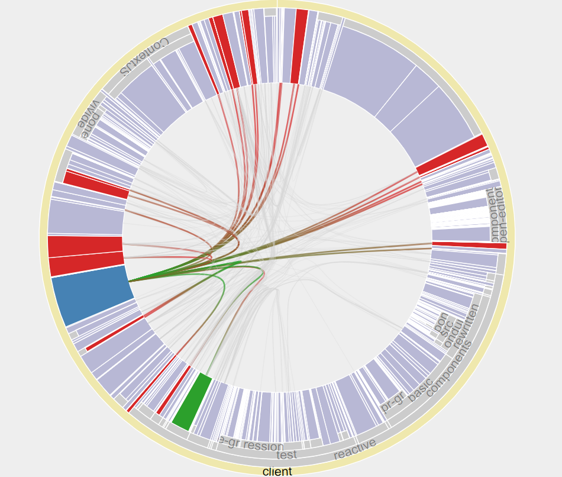

## 2024-08-06 Creating the Lively BundleView
*Author: @onsetsu*

- Showing <a id='top-level-url'>fooo</a> as a bundleview.
- Edges show import dependencies.
  - Only dynamic dependencies within the top-level folder are shown.

  <d3-bundleview id='bundleview' width='600px' height='400px'></d3-bundleview>

preview image:

{ width=600px}
