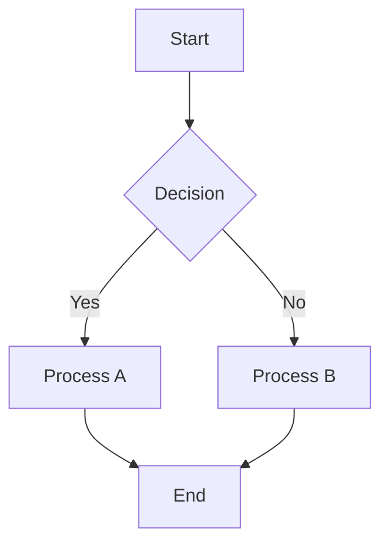

# 2025-08-05 Mermaid Diagram Integration in LivelyMarkdown

Successfully integrated Mermaid.js diagram rendering into the `lively-markdown` component, enabling rich diagram visualization directly within markdown content.

### Implementation Details

- **Version**: Mermaid.js 11.4.0 loaded from CDN
- **Integration**: Added `processMermaidDiagrams()` method to `lively-markdown.js`
- **Location**: [src/components/widgets/lively-markdown.js:337-420](edit://src/components/widgets/lively-markdown.js)

### Supported Diagram Types

✅ **Working Diagrams:**
- Flow Charts (`graph`, `flowchart`)
- Sequence Diagrams (`sequenceDiagram`) 
- Class Diagrams (`classDiagram`)
- State Diagrams (`stateDiagram-v2`)
- Entity Relationship (`erDiagram`)
- User Journey (`journey`)
- Git Graph (`gitGraph`)
- Pie Charts (`pie`)
- Gantt Charts (`gantt`)
- Timeline (`timeline`)
- Quadrant Chart (`quadrantChart`)

❌ **Known Issues:**
- **Mindmaps** (`mindmap`) - Compatibility issue with Lively4's Shadow DOM environment
  - Error: "E.id is not a function" in Cytoscape.js layout engine
  - Works in standalone HTML but fails within Lively4's SystemJS/Shadow DOM context
  - Alternative: Use flowchart diagrams for hierarchical visualization

### Technical Architecture

**Rendering Process:**
1. Detect mermaid code blocks by `language-mermaid` class
2. Initialize Mermaid with `securityLevel: 'loose'`
3. Use `mermaid.render()` to generate SVG content
4. Replace code blocks with rendered diagrams
5. Handle errors gracefully with inline error display

**Error Handling:**
- Failed diagrams show inline error messages within the component
- No DOM pollution - errors stay contained within markdown component
- Visual feedback during processing (orange border, opacity changes)

### Example Usage

````markdown

````

### Example Files

- **Comprehensive Examples**: [demos/claude/mermaid-markdown-examples.md](edit://demos/claude/mermaid-markdown-examples.md)
- **Standalone Test**: [demos/claude/mermaid-test.html](edit://demos/claude/mermaid-test.html)
- **Mindmap Test**: [demos/claude/mermaid-mindmap-test.html](edit://demos/claude/mermaid-mindmap-test.html)

### Key Learnings

1. **Shadow DOM Considerations**: Some Mermaid diagram types (especially mindmaps) expect global DOM access
2. **Simple is Better**: Avoided complex workarounds in favor of clean error handling
3. **Graceful Degradation**: Unsupported diagrams show helpful error messages rather than breaking the page
4. **Component Encapsulation**: All rendering stays within the markdown component's boundaries

### Next Steps

- [ ] Monitor for Mermaid.js updates that might fix mindmap Shadow DOM compatibility
- [ ] Consider contributing upstream fix for mindmap Shadow DOM issues
- [ ] Explore custom CSS themes for better integration with Lively4's design

All Mermaid diagrams now render automatically in any Lively4 markdown file! 🎉