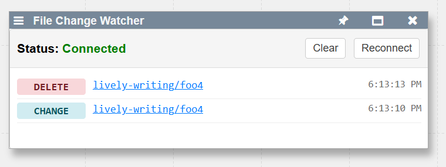

## 2025-08-06 Real-time Collaboration Infrastructure #filewatch #agents #collaboration
*Author: @JensLincke with @BlindGoldie*

Implemented [`lively-change-watcher`](open://lively-change-watcher) component for real-time file system monitoring and automatic editor synchronization.

{width=400px}

- **Added**: [src/components/widgets/lively-change-watcher.js](edit://src/components/widgets/lively-change-watcher.js), [.html](edit://src/components/widgets/lively-change-watcher.html)
- **Modified**: [src/client/contextmenu.js](edit://src/client/contextmenu.js) - added Tools menu entry
- **Modified**: [src/components/tools/lively-container.js](edit://src/components/tools/lively-container.js) - extracted reactive update logic
- **WebSocket**: Connection to `/_filewatch` endpoint for real-time file events
- **Auto-discovery**: Uses `SearchRoots.getSearchRoots()` + current `lively4url` directory
- **Container sync**: Updates `lively-container` elements without unsaved changes, warns for those with unsaved changes
- **Path resolution**: Uses `lively.files.resolve()` for `edit://` URLs with `..` navigation
- **UI**: Clickable file links, color-coded events (CREATE/DELETE/CHANGE), connection status

**Reactive Updates System:**
- **Extracted**: `applyOutsideChanges(url, force, externalSourceCode)` from `onSave()` for reusability
- **Hash-based deduplication**: SHA-1 content hashing prevents duplicate updates (`lively.fileChangeHashes` Map)
- **Interactive saves**: `force=true` always applies updates and records hash
- **External updates**: `force=false` checks hash, skips if duplicate
- **Source handling**: External calls fetch fresh content, internal calls use editor content
- **Visual indicators**: Files with no open containers marked with `◦` symbol and dimmed

**Technical details:**
- `calculateContentHash()` uses `crypto.subtle.digest('SHA-1')` like git
- `markChangeAsUnopened()` flags changes with `_noOpenContainer` for UI indication
- External updates: `fetch(url).then(r => r.text())` → `applyOutsideChanges(url, false, freshContent)`
- Internal saves: `applyOutsideChanges(url, true)` → uses `this.getSourceCode()`

### TODO

- [ ] #TODO make sure the file watcher deregisters when closing the component
