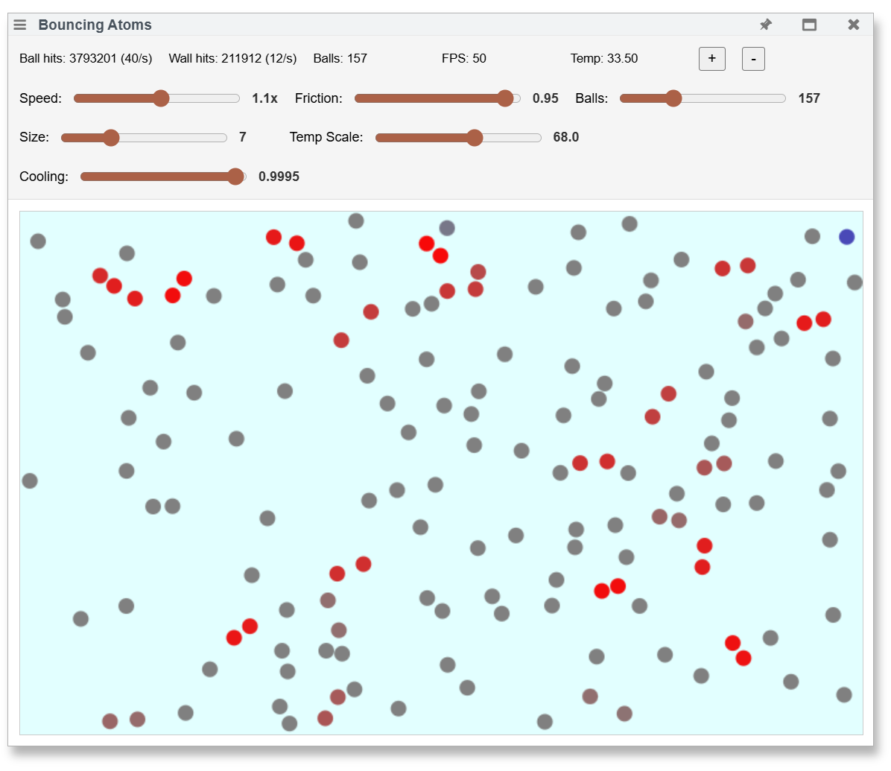
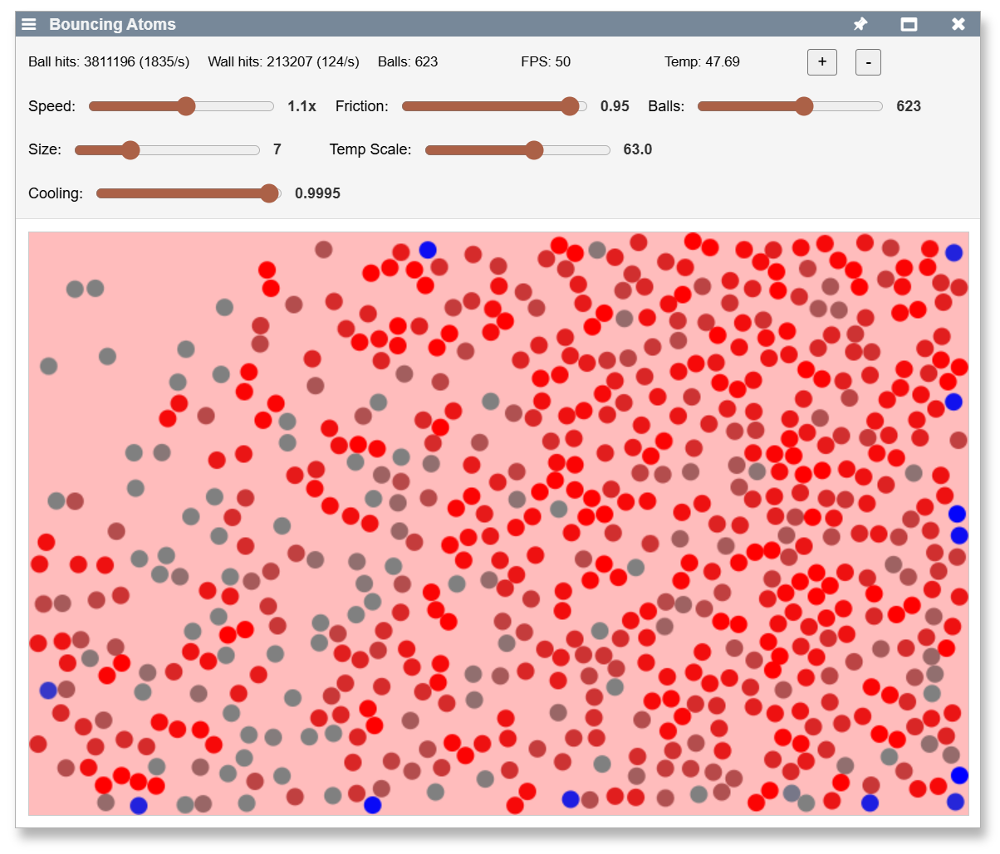
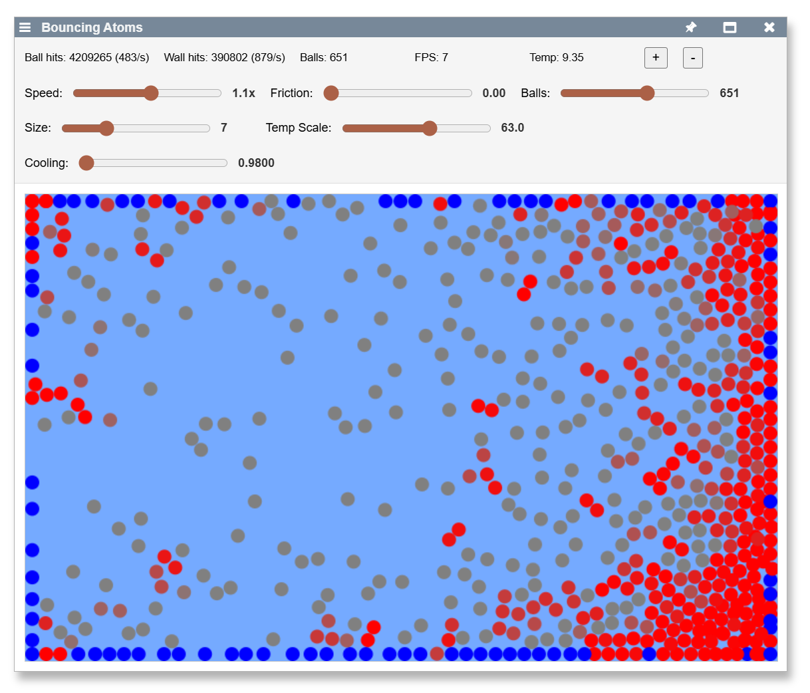

## 2025-08-08 ## Bouncing Ball Physics Simulation Development #AI-collaboration #physics #thermodynamics #user-interface

*Author: @JensLincke with @BlindGoldie*

A comprehensive session developing an interactive physics simulation through iterative AI-human collaboration, starting from basic collision fixes and evolving into a sophisticated thermodynamics visualization with extensive real-time controls.

- **Modified**: [lively-bouncing-ball.js](edit://src/components/demo/lively-bouncing-ball.js), [lively-bouncing-ball.html](edit://src/components/demo/lively-bouncing-ball.html)
- **Enhanced**: Physics engine, collision detection, UI controls, temperature visualization system
- **Added**: Multiple logarithmic sliders, FPS monitoring, thermodynamic heat simulation, color-coded temperature display

Component [bouncing balls](open://lively-bouncing-ball) 

{width=300px}
{width=300px}
{width=300px}

## Technical Evolution

### Phase 1: Basic Physics Corrections
**Issue Identification**: User observed balls moving too fast and colliding incorrectly
- **Speed adjustment**: Reduced ball movement multiplier from 1.0 to 0.3 for more observable motion
- **Collision penetration bug**: Balls were moving into each other instead of bouncing properly
- **Root cause analysis**: Discovered mismatch between rendering radius (`ballSize * 2`) and collision detection (`ballSize`)
- **Elegant solution**: Fixed rendering to use `ballSize` instead of modifying all collision logic
- **Physics improvement**: Replaced simple velocity reversal with proper elastic collision physics using angle-based velocity exchange

### Phase 2: User Interface Expansion
**Progressive control enhancement** as simulation complexity grew:
- **Friction slider**: Added 0.80-1.00 range for real-time energy dissipation control with 5% energy loss as default
- **Ball count management**: Implemented logarithmic slider (0-10000) with exponential mapping for precise control at low counts while accessing extreme ranges
- **Visual scaling**: Created ball size slider (2-20 pixels) for adjustable visual representation
- **Layout robustness**: Enhanced with flexbox to handle control wrapping gracefully when UI elements exceed single row

### Phase 3: Performance Monitoring and Statistics
**System observability improvements**:
- **Performance tracking**: Integrated FPS monitoring to observe rendering performance under different ball counts
- **Collision analytics**: Added comprehensive statistics tracking ball-ball hits/sec and wall hits/sec
- **Safety mechanisms**: Debugged continuous button press logic, expanding maximum from 2000 to 10000 balls with proper interval management
- **Responsive design**: Fixed layout issues when controls wrapped to multiple lines, ensuring canvas remains visible

### Phase 4: Thermodynamics Implementation
**Energy conservation modeling**:
- **Temperature concept**: Introduced friction energy loss → heat conversion following conservation of energy principles
- **Initial complexity**: Started with sliding window approach (180-frame energy accumulation) for temporal smoothing
- **Simplification insight**: User questioned necessity of sliding window; simplified to direct accumulation (`temperature += energyLost`) with continuous cooling
- **Visual feedback**: Implemented heat-based background coloring transitioning through thermal spectrum
- **Realistic cooling**: Applied exponential decay per frame to simulate natural heat dissipation

### Phase 5: Temperature System Calibration
**Real-world parameter adjustment**:
- **Scale mismatch discovery**: User reported actual temperatures around 200, far exceeding expected 3-7 range
- **Dynamic calibration**: Added temperature scale slider for real-time color mapping adjustment
- **Thermal equilibrium**: Created cooling rate slider (0.980-0.9999) enabling balance between heat generation and dissipation
- **Color spectrum refinement**: User requested avoiding green; implemented blue → white → red progression
- **Final scaling challenge**: Temperatures reached 1000+; implemented logarithmic temperature scale (1-1000 range) with fine control at low end

### Phase 6: Advanced UI Patterns
**Logarithmic control implementation**:
- **Ball count slider**: Exponential mapping `(e^(sliderValue/25) - 1) * scaling_factor` for 0-10000 range
- **Temperature scale slider**: Logarithmic mapping `10^(sliderValue/100 * 3)` for 1-1000 range
- **User experience**: Fine control where needed (low values) while maintaining access to extreme ranges
- **Bi-directional conversion**: Implemented proper slider↔value conversion for state persistence

## Development Methodology Insights

**Collaborative AI-Human Pattern**:
1. **User observation**: "balls move into each other", "temperature is 200"
2. **AI systematic analysis**: Root cause identification, exploring implementation options  
3. **Iterative refinement**: Each solution revealed new optimization opportunities
4. **User guidance**: Simplification suggestions ("is sliding window necessary?"), UI preferences ("avoid green")
5. **Parameter exploration**: Sliders enabled real-time experimentation and system understanding

**Technical Decision Evolution**:
- **Complexity → Simplicity**: Sliding window temperature system replaced with direct accumulation
- **Fixed → Dynamic**: Hard-coded values replaced with user-controllable parameters
- **Linear → Logarithmic**: UI controls evolved to handle wide parameter ranges effectively
- **Aesthetic refinement**: Color choices guided by user preference and thermal physics intuition

## Physics Accuracy Achieved

**Energy Conservation**: Kinetic energy converts to thermal energy via friction, with natural cooling creating realistic temperature equilibrium

**Collision Physics**: Proper elastic collisions with angle-based velocity exchange, friction-based energy dissipation, and separation logic preventing overlap

**Thermodynamic Behavior**: System demonstrates heat buildup during active periods, gradual cooling during quiescence, and equilibrium states where energy input balances cooling rate

## Technical Architecture Highlights

**State Persistence**: All slider values persist across component reloads via `livelyPrepareSave()`/`livelyMigrate()` pattern

**Logarithmic Scaling**: Two independent logarithmic sliders (balls: 0-10K, temp scale: 1-1000) with proper bidirectional conversion

**Real-time Visualization**: Temperature directly controls background color through RGB interpolation across thermal spectrum

**Performance Monitoring**: FPS tracking enables observation of system limits under extreme parameters

## User Experience Patterns

**Progressive Disclosure**: Started with basic physics, gradually revealed advanced controls as system complexity increased

**Immediate Feedback**: All parameter changes apply instantly, enabling intuitive exploration of parameter space

**Visual Integration**: Color-coded temperature provides immediate system state understanding

**Wide Dynamic Range**: Logarithmic controls enable precise adjustment across orders of magnitude

## Future Development Opportunities

- [ ] #TODO Temperature units: Consider physical temperature scales (Kelvin, Celsius) rather than arbitrary units
- [ ] #TODO Ball-ball friction: Implement thermal energy exchange between colliding balls  
- [ ] #TODO Advanced thermodynamics: Heat diffusion, thermal conductivity modeling
- [ ] #TODO Performance optimization: Spatial partitioning for collision detection at extreme ball counts
- [ ] #TODO Additional visualizations: Heat maps, energy flow indicators, phase transitions

## Collaboration Assessment

This session exemplified effective AI-human collaboration in iterative software development. The AI provided systematic debugging, implementation expertise, and technical options exploration, while the human provided domain insight, simplification guidance, aesthetic direction, and real-world parameter validation. The combination produced a sophisticated physics simulation that evolved naturally from basic collision fixes to advanced thermodynamic visualization.

The iterative approach - fix, enhance, observe, refine - proved highly effective for creating complex interactive systems where parameter relationships are discovered through experimentation rather than predetermined.