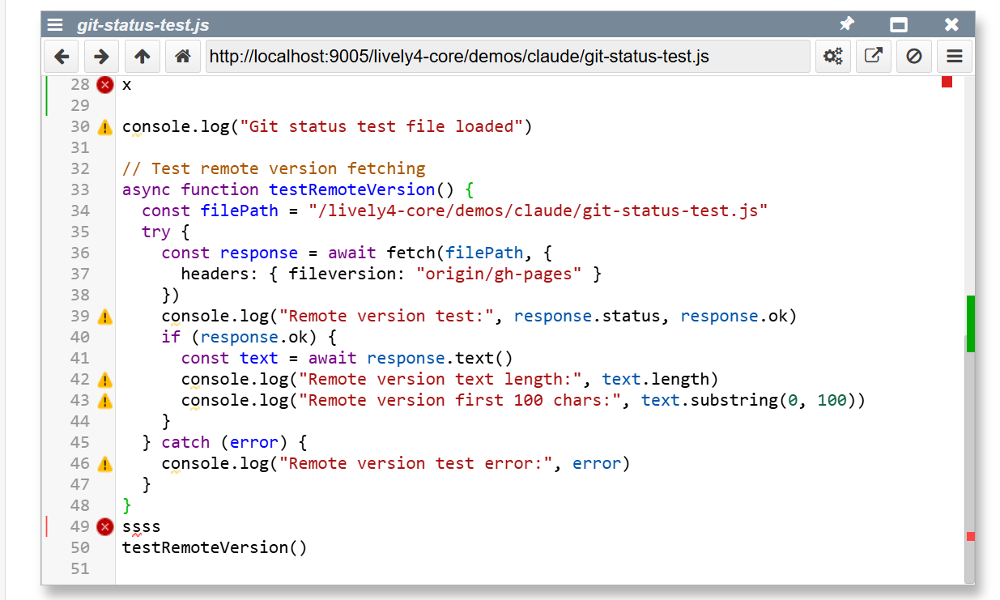

## 2025-08-11 # Documentation and Git Line Status Feature Design
*Author: @JensLincke [with @BlindGoldie]*

- update lively server documentation: terminal and auth 
- create corresponding auth doc

## Git Line Status Visualization Feature COMPLETED 
*Added: VSCode-style line-level git change indicators in lively-editor*

**Objective**: Add color-coded gutter indicators showing:
- 🔴 **Red**: Unsaved changes (editor vs last saved) 
- 🟠 **Orange**: Uncommitted changes (saved vs HEAD) 
- 🟢 **Green**: Unpushed changes (HEAD vs origin/branch) 

**Technical Approach**:
- **Client-side diff-match-patch** instead of server-side git diff
- Leverage existing `lively4-server` file versioning via `fileversion` headers
- Integrate with existing `lively-code-mirror.js` gutter system
- Hook into current change detection in `lively-editor.js`

**Key Components**:
- **lively-editor.js**: Add `getLineChangeStatus()`, `getCommittedVersion()`, `getRemoteVersion()` 
- **lively-code-mirror.js**: Extend gutter with change markers using `setGutterMarker()`
- **Data sources**: `this.getText()`, `this.lastText`, `fetch(url, {headers: {fileversion: "HEAD"}})`, `fetch(url, {headers: {fileversion: "origin/branch"}})`

**Implementation Strategy**:
```javascript
// New methods in lively-editor.js
async getLineChangeStatus() {
  const dmp = new diff.diff_match_patch();
  const currentText = this.getText();
  const savedText = this.lastText || "";
  const committedText = await this.getCommittedVersion();
  const remoteText = await this.getRemoteVersion();
  
  return {
    unsaved: this.parseLineDiffs(dmp.diff_main(savedText, currentText)),
    uncommitted: this.parseLineDiffs(dmp.diff_main(committedText, savedText)), 
    unpushed: this.parseLineDiffs(dmp.diff_main(remoteText, committedText))
  };
}
```

**Advantages**:
- Uses existing `diff-match-patch.js` (already integrated)
- No new server endpoints needed (uses `git show` via `readFileVersion`)
- Client-side performance, no shell command overhead
- Integrates with existing change detection (`updateChangeIndicator()`)
- Works with current file watching system (`lively-change-watcher.js`)

**CodeMirror Integration Research**:
-  **Analyzed existing gutter usage**: `leftgutter`, `rightgutter`, `CodeMirror-linenumbers`, `CodeMirror-lint-markers`
-  **Found VSCode-style approach**: Use colored left borders on line numbers instead of separate gutter
- **API Methods**: `editor.setGutterMarker()`, `editor.clearGutter()` for traditional approach
- **Better approach**: Direct CSS styling of `.CodeMirror-linenumber` elements with colored borders

**Updated Implementation Strategy (VSCode-style)**:
```css
/* Add to lively-code-mirror.html */
.git-status-unsaved { border-left: 3px solid #ff4444 !important; }
.git-status-uncommitted { border-left: 3px solid #ff8800 !important; }  
.git-status-unpushed { border-left: 3px solid #00aa00 !important; }
```

```javascript
// In lively-code-mirror.js - style line numbers directly
updateGitStatusIndicators(changes) {
  // Clear existing classes
  this.editor.display.lineDiv.querySelectorAll('.CodeMirror-linenumber')
    .forEach(el => el.classList.remove('git-status-unsaved', 'git-status-uncommitted', 'git-status-unpushed'));
  
  // Apply git status classes
  changes.unsaved.forEach(lineNum => {
    const lineEl = this.editor.display.lineDiv.querySelector(`[data-line="${lineNum}"] .CodeMirror-linenumber`);
    if (lineEl) lineEl.classList.add('git-status-unsaved');
  });
}
```

**Benefits**:
- Matches VSCode user expectations
- No gutter configuration changes needed
- Clean CSS-only styling approach
- Better performance than DOM manipulation

**Implementation Progress**:
- [x] Research CodeMirror gutter API implementation details
- [x] Update design to use VSCode-style line number border approach  
- [x] **Added CSS styles** to `lively-code-mirror.html` for git status indicators
- [x] **Added JavaScript methods** to `lively-code-mirror.js`: `updateGitStatus()`, `updateGitStatusIndicators()`
- [x] **Added diff-match-patch integration** to `lively-editor.js`: `getLineChangeStatus()`, `parseLineDiffs()`
- [x] **Implemented unsaved changes detection** (red indicators)
- [x] **Created test file** `demos/claude/git-status-test.js` for verification

**Files Modified**:
- **Added**: [demos/claude/git-status-test.js](edit://demos/claude/git-status-test.js) - Test file for git status feature
- **Modified**: [src/components/widgets/lively-code-mirror.html](edit://src/components/widgets/lively-code-mirror.html) - Added CSS for git status styling
- **Modified**: [src/components/widgets/lively-code-mirror.js](edit://src/components/widgets/lively-code-mirror.js) - Added git status update methods, hooked into change events
- **Modified**: [src/components/tools/lively-editor.js](edit://src/components/tools/lively-editor.js) - Added line-level diff analysis and git version fetching methods

**FEATURE COMPLETE **

**Final Implementation**: 
-  **VSCode-style persistent gutter markers** using `setGutterMarker()`
-  **Priority system**: unsaved changes dominate uncommitted changes
-  **Real-time updates** trigger 500ms after editing
-  **Inline JSX styling** with colored vertical bars (`│`)
-  **Full git integration**: HEAD versions via `fileversion` headers
-  **Error handling** for missing git versions

**Critical Bug Fixes**:
- Fixed `this.url` vs `this.getURL()` bug in `getCommittedVersion()` - user discovery
- Fixed gutter marker persistence during typing by using CodeMirror's `setGutterMarker()` API
- Fixed CSS-to-JSX styling transition for proper visibility
- Fixed parent component lookup (`lively.query(this, "lively-editor")`)

**Change Detection Status**:
- [x] Unsaved changes (red `#ff4444`)
- [x] Uncommitted changes (orange `#ff8800`) 
- [X] Unpushed changes (green `#00aa00`)

----

## Git Status Scrollbar Integration ✨
*Enhancement by @JensLincke with @BlindGoldie refactoring*

Extended the git line status feature with **scrollbar annotations** providing VSCode-style change overview.

**Implementation Unified & Enhanced**:
- **Consistent priority filtering**: Both gutter and scrollbar use same logic (unsaved > uncommitted > unpushed)
- **Color constants centralization**: `gitStatusColors` getter for consistent styling
- **Performance optimized**: Pre-filtered Sets eliminate redundant priority checks
- **Error handling**: Graceful degradation for scrollbar annotation failures  
- **Memory management**: `clearGitStatusAnnotations()` cleanup method
- **Simplified data flow**: Single filtering pass shared between gutter and scrollbar

**Technical Features**:
- **CodeMirror integration**: `editor.annotateScrollbar()` with CSS classes
- **CSS styling**: `.CodeMirror-scrollbar-change-status-{kind}` with matching colors
- **Efficient updates**: Cached annotation instances in `_gitAnnMap`
- **Range mapping**: Line numbers converted to CodeMirror `Pos` objects

**User Experience**:
- 🎯 **Gutter indicators**: Precise line-by-line change visualization  
- 📊 **Scrollbar overview**: Quick navigation to changed sections
- 🚀 **VSCode parity**: Professional git integration matching industry standards




