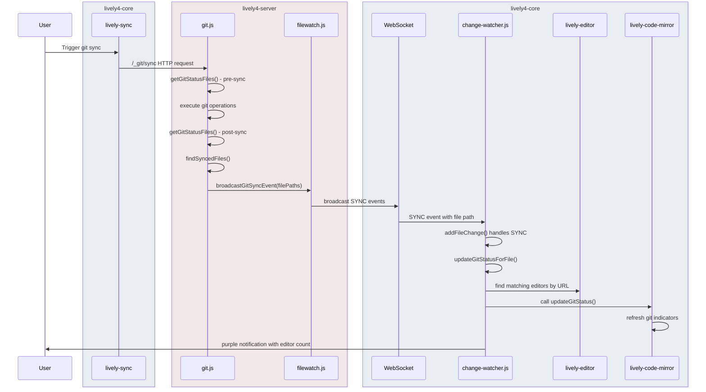

## 2025-08-12 Git Status Scrollbar Integration & Code Unification
*Author: @JensLincke [with @BlindGoldie]*

Unified and enhanced the git line status visualization feature by combining gutter and scrollbar implementations.

- **Enhanced**: [src/components/widgets/lively-code-mirror.js](edit://src/components/widgets/lively-code-mirror.js) - Unified priority logic, added color constants, performance optimization, error handling
- **Feature**: Git status scrollbar annotations using CodeMirror `annotateScrollbar()` API
- **Refactor**: Single filtering pass shared between gutter and scrollbar indicators
- **Added**: `clearGitStatusAnnotations()` cleanup method for proper memory management

**Technical Improvements**:
- **Priority consistency**: Both gutter and scrollbar use same filtering logic (unsaved > uncommitted > unpushed)
- **Color centralization**: `gitStatusColors` getter ensures consistent styling across components
- **Performance**: Pre-filtered Sets eliminate redundant priority checks during rendering
- **Error handling**: Graceful degradation for scrollbar annotation failures
- **Memory management**: Proper cleanup methods for CodeMirror annotation instances

**User Experience**:
- **Gutter indicators**: Line-by-line change visualization for precise editing
- **Scrollbar overview**: Quick navigation to changed sections (VSCode-style)
- **Professional integration**: Industry-standard git status visualization

**Implementation Status**:
- [x] Unsaved changes
  <lively-color color="#228B22"></lively-color>(dark green `#228B22`) - **WORKING**
- [x] Uncommitted changes
  <lively-color color="#FFD700"></lively-color>(yellow `#FFD700`) - **WORKING** with text annotations
- [x] Unpushed changes
  <lively-color color="#90EE90"></lively-color>(light green `#90EE90`) - **WORKING**

**Additional Enhancements**:
- **Color scheme redesign**: Changed from "error-like" red to development-friendly colors
- **Text annotations**: Added yellow background highlighting for uncommitted changes using CodeMirror markText API
- **CSS custom properties**: Eliminated color duplication using single source of truth approach
- **Gutter width**: Doubled indicator width from 20px to 40px for better visibility

**Color Logic**:
- <lively-color color="#228B22"></lively-color> **Dark green**: Unsaved changes (your active local edits)
- <lively-color color="#FFD700"></lively-color> **Yellow**: Uncommitted changes (saved but not committed, from outside)
- <lively-color color="#90EE90"></lively-color> **Light green**: Unpushed changes (committed but not pushed)

**Technical Implementation**:
- **Text annotations**: `editor.markText()` with CSS styling for uncommitted changes
- **CSS custom properties**: `--git-status-*` variables in `:host` for color consistency
- **Single source colors**: JavaScript reads from CSS via `getComputedStyle()`
- **Memory management**: `clearGitTextAnnotations()` for proper cleanup

## New Component: lively-color
*Simple color swatch component for documentation*

Created a reusable web component for displaying color samples in markdown documentation.

- **Added**: [src/components/widgets/lively-color.js](edit://src/components/widgets/lively-color.js) - Color swatch web component
- **Added**: [src/components/widgets/lively-color.html](edit://src/components/widgets/lively-color.html) - Component template
- **Component**: Simple `<lively-color color="#FFD700"></lively-color>` API for inline color swatches
- **Features**: Responsive sizing, attribute watching, clean default styling
- **Usage**: Replaces verbose inline div elements in documentation with semantic component

**Technical Implementation**:
- **Extends Morph**: Follows standard Lively4 component patterns
- **Attribute observation**: `color` and `size` attributes with automatic updates
- **Default styling**: 15px square with border and proper vertical alignment
- **Self-contained**: No external dependencies, minimal CSS footprint

**Example Usage**:
```html
<lively-color color="#FF6600"></lively-color> Orange
<lively-color color="#0066CC" size="20px"></lively-color> Blue (larger)
```

<lively-color color="#FF6600"></lively-color> Orange example
<lively-color color="#0066CC" size="20px"></lively-color> Blue example (20px)

**Files Modified**:
- **Modified**: [src/components/widgets/lively-code-mirror.js](edit://src/components/widgets/lively-code-mirror.js) - Unified git status implementation, text annotations, color system
- **Modified**: [src/components/widgets/lively-code-mirror.html](edit://src/components/widgets/lively-code-mirror.html) - CSS custom properties for color consistency
- **Added**: [src/components/widgets/lively-color.js](edit://src/components/widgets/lively-color.js) - Color swatch component
- **Added**: [src/components/widgets/lively-color.html](edit://src/components/widgets/lively-color.html) - Component template

## Git Sync Notification Flow
*Real-time git status synchronization across all editors*

Implemented comprehensive git sync notification system that automatically updates all open editors when git operations complete.

**Server-Side Integration**:
- **Enhanced**: [lively4-server/src/services/git.js](edit://lively4-server/src/services/git.js) - Added git status tracking methods
- **Enhanced**: [lively4-server/src/services/filewatch.js](edit://lively4-server/src/services/filewatch.js) - Added `broadcastGitSyncEvent()` for SYNC notifications
- **Feature**: `/_git/sync` endpoint hooks into FileWatchService to broadcast file changes after git operations

**Client-Side Integration**:
- **Enhanced**: [src/components/widgets/lively-change-watcher.js](edit://src/components/widgets/lively-change-watcher.js) - Added SYNC event handling and editor refresh
- **Enhanced**: [src/components/widgets/lively-change-watcher.html](edit://src/components/widgets/lively-change-watcher.html) - Added styling for SYNC events
- **Feature**: Automatic git status refresh in all matching editors when files are synced

**System Architecture**:



**Data Flow Details**:
1. **Server Detection**: Git status comparison before/after sync operations
2. **FileWatch Integration**: SYNC events broadcast for changed git metadata
3. **WebSocket Transport**: Real-time notification to all connected clients
4. **Client Processing**: Change watcher identifies matching editors by file path
5. **Git Status Refresh**: Editors automatically update their visual indicators

**Technical Implementation**:
- **Pre/Post Comparison**: `getGitStatusFiles()` captures uncommitted/unpushed files before and after sync
- **File Path Matching**: `findSyncedFiles()` identifies files that changed from dirty to clean
- **WebSocket Events**: SYNC type events with file paths and metadata
- **Editor Matching**: URL comparison to find editors displaying affected files
- **Status Refresh**: `updateGitStatus()` recalculates and redraws all indicators

**User Experience**:
- **Real-time Updates**: Git status changes immediately visible across all open editors
- **Visual Feedback**: Purple notifications for sync events with editor count
- **No Manual Refresh**: Automatic synchronization eliminates need to reload files