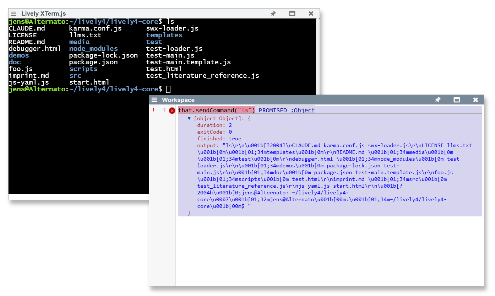

## 2025-08-13 Journal System Development #journal #development
*Author: @JensLincke [with @BlindGoldi]*

Enhanced journal entry creation and cursor positioning functionality in Lively4 development environment.

- **Modified**: [src/client/journal.js](edit://src/client/journal.js) - Added cursor positioning to end of file after creating new journal entries
- **Modified**: [src/client/lively.js](edit://src/client/lively.js) - Added whitespace for code organization
- **Modified**: [src/systemjs-config.js](edit://src/systemjs-config.js) - Added debugging check for Response object type validation in source handling

**Technical details:**
- Implemented cursor positioning logic in `Journal.createEntry()` using CodeMirror API
- Added `setCursor(lastLine, lastCh)` to position cursor at end of newly created journal files
- Enhanced user experience by automatically focusing editor and positioning cursor for immediate editing
- Added type checking safeguards in SystemJS source handling to catch Response object bugs

**INVESTIGATION FINDINGS:**

Found the root cause of Response objects in `System.orignalSources`. The issue is in [src/systemjs-config.js:125-130](edit://src/systemjs-config.js):

```javascript
source = await fetch(url, options).then(function (res) {
  if (!res.ok || jsonCssWasmContentType.test(res.headers.get('content-type'))) {
    return res; // BUG: Returns Response object instead of text
  }
  return res.text()
})
```

**Root Cause:**
- When fetch fails (`!res.ok` is true), the code returns the Response object directly
- This Response object then gets stored in `System.orignalSources.set(url, source)`
- Later code expects strings but finds Response objects, causing the journal.js issue

**Solution needed:**
- Always convert Response objects to text or handle them properly
- Consider what should happen when fetch fails (empty string, error, etc.)

## Terminal Integration with Claude Code #terminal #claude #xterm

Enhanced lively-xterm component with programmatic command execution and Claude Code integration.

- **Modified**: [src/components/tools/lively-xterm.js](edit://src/components/tools/lively-xterm.js) - Added command execution capabilities and cwd support
- **Modified**: [src/client/contextmenu.js](edit://src/client/contextmenu.js) - Added Claude menu entry in Tools section  
- **Modified**: [lively4-server/src/services/terminal.js](edit://lively4-server/src/services/terminal.js) - Added cwd header processing with path resolution

**Technical details:**
- Added `sendCommand(command)` method for programmatic command execution via WebSocket
- Added `sendText(text)` method for sending text without automatic execution
- Implemented `command` attribute for automatic command execution on terminal startup
- Fixed cwd handling to resolve paths like `/lively4-core` to `/home/jens/lively4/lively4-core`
- Added context menu entry "Claude" that opens xterm in `/lively4-core` with `claude -c` command
- Resolved timing issues with command execution by using WebSocket.send() instead of terminal paste()

**Integration points:**
- Context menu integration allows quick Claude Code access from any Lively4 location
- Server-side path resolution enables clean relative path handling
- WebSocket command sending bypasses paste security restrictions

## HTTP Command Execution API #terminal #api #server




Implemented server-side command execution endpoint with client integration for Promise-based terminal command results.

- **Added**: [lively4-server/src/services/terminal.js](edit://lively4-server/src/services/terminal.js) - HTTP exec endpoint `/_terminal/exec/{pid}`
- **Modified**: [src/components/tools/lively-xterm.js](edit://src/components/tools/lively-xterm.js) - Updated `sendCommand()` to use HTTP API
- **Updated**: [lively4-server/CHANGELOG.md](edit://lively4-server/CHANGELOG.md) - Documented API changes and features

**Technical implementation:**
- `executeCommand(pid, req, res)` method processes JSON command requests
- `captureCommandOutput(term, command, pid)` handles output buffering and prompt detection
- Prompt pattern detection `/[\$#>]\s*$/` with 5-second timeout for completion
- Dual output streams: HTTP response results + live WebSocket terminal display
- Commands executed via API appear in terminal logs via `this.logs[pid] += data`

**Client integration:**
- `sendCommand()` now returns Promise with `{ output, exitCode, duration, finished }` 
- Maintains backward compatibility while providing programmatic command results
- Automatic command execution on terminal startup updated for async operation

**Usage examples:**
```javascript
// Promise-based command execution with results
const result = await xtermComp.sendCommand('git status');
console.log(result.output, result.duration);

// Commands still appear in live terminal display
```

## Template Update Debug Enhancement #debugging #migration #codemirror
*Author: @JensLincke [with @BlindGoldi]*

Fixed template update issues for lively-code-mirror components and enhanced debugging capabilities with comprehensive logging and visual feedback.

- **Modified**: [src/client/lively.js](edit://src/client/lively.js) - Enhanced updateTemplate with debug logging and subtle visual feedback
- **Modified**: [src/components/widgets/lively-code-mirror.js](edit://src/components/widgets/lively-code-mirror.js) - Added livelyUpdateStrategy and fixed migration syntax

**Root cause discovered:**
- **lively-color** extends `Morph` → inherits `livelyUpdateStrategy = 'migrate'` → participates in template updates
- **lively-code-mirror** extends `HTMLElement` → `livelyUpdateStrategy = undefined` → gets skipped during updates

**Technical implementation:**
- Added comprehensive debug logging using `debug.debugPrint()` for consistent instance naming
- Enhanced migration process logging with emoji indicators and detailed state tracking
- Fixed broken `livelyMigrate` syntax error in lively-code-mirror (missing parenthesis)
- Added `livelyUpdateStrategy` getter returning 'migrate' to enable proper template updates

**Debug logging features:**
```javascript
🔄 Template Update: lively-code-mirror from http://...
📊 Found 2 instances to migrate: ["lively-code-mirror1", "lively-code-mirror2"]
🔍 Processing lively-code-mirror1:
  🔄 Migrating lively-code-mirror1 → lively-code-mirror2
  🧬 lively-code-mirror2 - calling livelyMigrate
  ✅ lively-code-mirror2 - livelyMigrate completed
```

**Subtle visual feedback:**
- Replaced intrusive red borders with minimal 6px colored dots in component corners
- Green dots for migrated components, blue for livelyUpdate strategy
- Ultra-low opacity (0.4) with gentle 0.6s fade animations
- Positioned in top-right corner to avoid UI obstruction

**Integration points:**
- Components extending HTMLElement now properly participate in template updates
- Debug logging provides visibility into migration success/failure states
- Visual feedback confirms template update activity without disrupting workflow
- Error handling with try/catch for migration method calls

**TODO**: 
- [x] #TODO Fix Response object handling in systemjs-config.js fetch logic
- [x] #TODO Implement command result capture/callback system for lively-xterm programmatic use
- [x] #TODO Fix lively-code-mirror template update skipping issue
- [x] #TODO Add comprehensive debugging to template migration process

