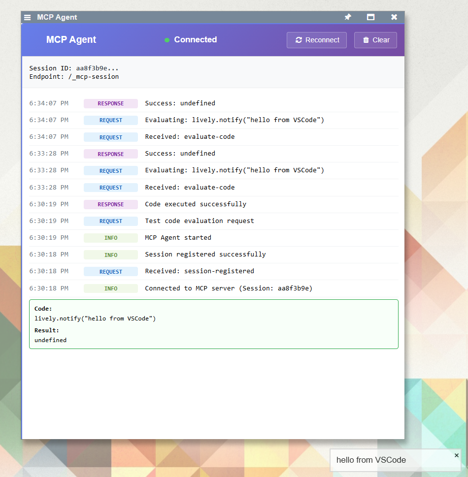
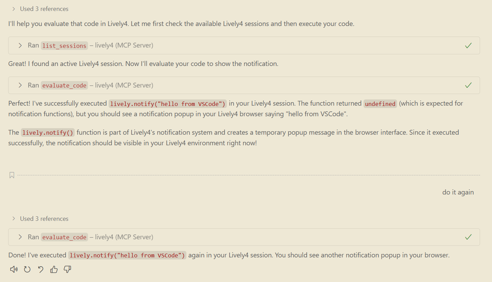

## 2025-08-14 Git Status Line Index Mapping Problem #git #codemirror #diff #debugging
*Author: @JensLincke with @BlindGoldie*

Fixed critical line indexing issue in Lively4's CodeMirror git status annotations where markers appeared off-by-one due to incorrect line number mapping across different text versions.

- **Modified**: [lively-editor.js](edit://src/components/tools/lively-editor.js) - Added proper line mapping methods
- **Modified**: [lively-code-mirror.js](edit://src/components/widgets/lively-code-mirror.js) - Enhanced text annotations
- **Added**: [git-status-test.md](edit://demos/claude/git-status-test.md) - Test file demonstrating the fix

**Feature**: Proper line number mapping across git text versions (current/saved/committed/pushed)
**UI**: Enhanced text annotations with tooltips showing change types and accurate line numbers

## The Core Problem

The original implementation computed line numbers relative to different text versions but displayed all markers in the current editor:

```
❌ Original (broken):
unsavedLines    → relative to currentText  ✓ (correct)
uncommittedLines → relative to savedText   ❌ (wrong reference frame!)  
unpushedLines   → relative to committedText ❌ (wrong reference frame!)
```

This caused markers to appear on incorrect lines when insertions/deletions shifted line numbers between versions.

## Scenario: Line Addition

**Scenario**: User adds a line at the beginning of file

| Pushed | Committed | Saved | Current |
|--------|-----------|-------|---------|
| 0: `function foo() {` | 0: `function foo() {` | <span style="background-color: #90EE90;">0: `// New comment`</span> | <span style="background-color: #90EE90;">0: `// New comment`</span> |
| 1: `  return 42` | 1: `  return 42` | <span style="background-color: #FFFF99;">1:</span> `function foo() {` | <span style="background-color: #FFB6C1;">1: `// Another comment`</span> |
| 2: `}` | 2: `}` | <span style="background-color: #FFFF99;">2:</span> `  return 42` | <span style="background-color: #FFFF99;">2:</span> `function foo() {` |
| | | <span style="background-color: #FFFF99;">3:</span> `}` | <span style="background-color: #FFFF99;">3:</span> `  return 42` |
| | | | <span style="background-color: #FFFF99;">4:</span> `}` |

<span style="background-color: #90EE90;">**Green**: Saved but not committed</span> | <span style="background-color: #FFB6C1;">**Pink**: Unsaved changes</span> | <span style="background-color: #FFFF99;">**Yellow**: Line numbers shifted</span>

**Problem with old approach**:
- Uncommitted diff detects that Committed line 0 (`function foo() {`) differs from Saved line 1 (`function foo() {`)
- ❌ Old code would mark Current line 1 (`// Another comment`) - WRONG!
- ✅ Should mark Current line 2 (`function foo() {`) - CORRECT!

**Solution with line mapping**:
1. Find uncommitted change: Saved[1] ≠ Committed[0] 
2. Map Saved line 1 → Current line 2 using diff-based line mapping
3. Display marker at correct Current line 2

## Scenario: Multiple Operations

**Scenario**: File undergoes insertions, deletions, and modifications across versions

| Pushed | Committed | Saved | Current |
|--------|-----------|-------|---------|
| 0: `function foo() {` | 0: `function foo() {` | 0: `function foo() {` | <span style="background-color: #FFB6C1;">0: `// Comment`</span> |
| 1: `  return 1` | <span style="background-color: #99ccff;">1: `  return 2`</span> | <span style="background-color: #99ccff;">1: `  return 2`</span> | <span style="background-color: #FFFF99;">1:</span> `function foo() {` |
| 2: `}` | <span style="background-color: #99ccff;">2: `  console.log("debug")`</span> | <span style="background-color: #90EE90;">2: `  let x = 5`</span> | <span style="background-color: #99ccff;"><span style="background-color: #FFFF99;">2:</span> `  return 2`</span> |
| | 3: `}` | <span style="background-color: #99ccff;">3: `  console.log("debug")`</span> | <span style="background-color: #90EE90;">3: `  let x = 5`</span> |
| | | <span style="background-color: #FFFF99;">4:</span> `}` | <span style="background-color: #99ccff;">4: `  console.log("debug")`</span> |
| | | | <span style="background-color: #FFFF99;">5:</span> `}` |

<span style="background-color: #99ccff;">**Blue**: Committed changes (pushed→committed)</span> | <span style="background-color: #90EE90;">**Green**: Saved but not committed</span> | <span style="background-color: #FFB6C1;">**Pink**: Unsaved changes</span> | <span style="background-color: #FFFF99;">**Yellow**: Line numbers shifted</span>

**Line mapping challenge**:
- Unpushed changes: Lines that changed from pushed→committed need mapping to current
- Uncommitted changes: Lines that changed from committed→saved need mapping to current  
- All displayed markers must reference current editor line numbers

## Technical Implementation

**New mapping methods**:
- `mapChangesToCurrentLines(committed, saved, current)` - Maps committed→saved changes to current lines
- `buildLineMapping(diffs)` - Creates line-to-line mapping using diff operations
- `mapLinesToCurrentText(source, current, lineNumbers)` - Maps any line numbers to current version

**Diff-based line mapping**:
```javascript
// Build mapping: sourceLine → currentLine
buildLineMapping(diffs) {
  let sourceLine = 0, currentLine = 0
  
  for (diff of diffs) {
    if (diff.operation === EQUAL) {
      mapping.set(sourceLine++, currentLine++) // Same content, advance both
    } else if (diff.operation === DELETE) {
      sourceLine++ // Source line deleted, no current equivalent  
    } else if (diff.operation === INSERT) {
      currentLine++ // New line in current, advance current only
    }
  }
}
```

## Example: Line Mapping Process

**Committed → Saved diff**:
```
EQUAL:   "function foo() {"     sourceLine=0 → currentLine=0
DELETE:  "  return 42"          sourceLine=1 → (no mapping)
INSERT:  "  let x = 5"          (no source) → currentLine=1  
INSERT:  "  return x + 42"      (no source) → currentLine=2
EQUAL:   "}"                   sourceLine=2 → currentLine=3
```

**Saved → Current diff**:
```
INSERT:  "// New comment"       (no source) → currentLine=0
EQUAL:   "function foo() {"     sourceLine=0 → currentLine=1
EQUAL:   "  let x = 5"         sourceLine=1 → currentLine=2
EQUAL:   "  return x + 42"     sourceLine=2 → currentLine=3
EQUAL:   "}"                   sourceLine=3 → currentLine=4
```

**Final mapping**: committedText line 0 → savedText line 0 → currentText line 1

## Key Insights

1. **Reference frame matters**: All displayed line numbers must be relative to current editor text
2. **Diff-based mapping**: Use diff operations to track how line numbers shift between versions
3. **Chain mapping**: Map through transformation chain (committed → saved → current) 
4. **Handle all operations**: EQUAL (unchanged), DELETE (removed), INSERT (added) affect line numbering differently

## Benefits Achieved

- **Accurate markers**: Git status indicators appear on correct lines
- **Better UX**: Tooltips show accurate line numbers and change descriptions
- **Robust handling**: Works with complex edit sequences (insertions, deletions, modifications)
- **Performance**: Efficient diff-based mapping with cleanup optimizations

**TODO**: 
- [ ] #TODO Consider caching line mappings for better performance on large files
- [ ] #TODO Add visual diff indicators showing what type of change occurred on each line


## Lively MCP Working!

Since @BlindGoldie needed a rest, @VSCodeCopilot had to step in





