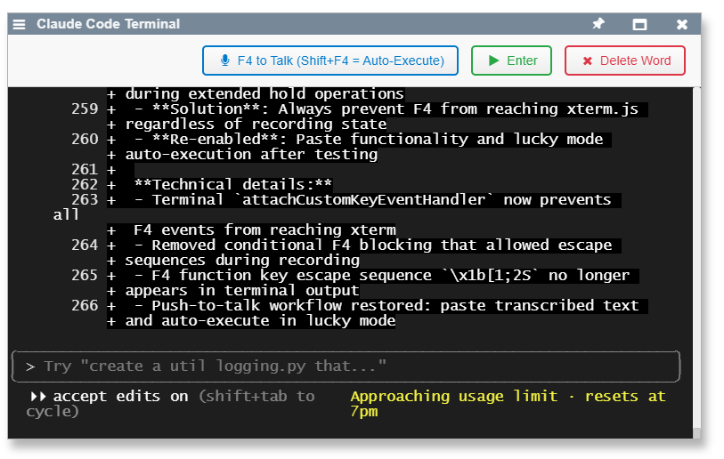

## 2025-08-15 Complete MCP Integration Implementation #mcp #integration #claude-code #websocket #protocol

*Author: @JensLincke [with @BlindGoldi]*

Implemented complete Model Context Protocol (MCP) integration for Lively4, enabling Claude Code to interact directly with live browser environments through a dual-connection architecture.

- **Added**: [src/components/tools/lively-mcp.js](edit://src/components/tools/lively-mcp.js), [src/components/tools/lively-mcp.html](edit://src/components/tools/lively-mcp.html) - Browser MCP agent component
- **Added**: [../lively4-server/src/services/mcp-server.js](edit://../../lively4-server/src/services/mcp-server.js) - Full MCP protocol server implementation
- **Added**: [../lively4-server/src/services/mcp-session.js](edit://../../lively4-server/src/services/mcp-session.js) - WebSocket session management service  
- **Modified**: [../lively4-server/src/http-server.js](edit://../../lively4-server/src/http-server.js) - Integrated MCP server with HTTP endpoints and WebSocket
- **Updated**: [doc/notes/mcp.md](edit://doc/notes/mcp.md) - Complete implementation documentation with architecture, usage guide, and API reference

**Architecture:**
- **Dual-connection design**: Browser ↔ Server (WebSocket) + Claude Code ↔ Server (MCP Protocol) 
- **Session isolation**: UUID-based session IDs for multi-user support
- **Real-time evaluation**: JavaScript code execution in live browser context via SystemJS
- **Error handling**: Timeout protection, connection recovery, graceful degradation

**Technical Implementation:**
- `Lively4McpServer`: Manual MCP protocol implementation with HTTP transport integration
- `McpSessionService`: WebSocket session registry with request/response correlation
- `lively-mcp` component: Browser agent with connection management and code evaluation
- Tool interface: `evaluate_code`, `list_sessions`, `ping_sessions` following MCP spec

**Integration Points:**
- HTTP endpoints: `/_mcp/message` (JSON-RPC), `/_mcp-session` (WebSocket)
- Session flow: Browser generates UUID → WebSocket registration → MCP targeting
- Code evaluation: Claude Code → MCP Server → WebSocket → Browser → SystemJS/eval()
- Response path: Results serialized and returned through reverse communication chain

**Testing Validation:**
- Successfully validated with session `3172388d-08b9-4f42-9898-130198ee7c3a`
- Executed `lively.notify("hello")` and window enumeration queries
- Active components: GitHub Sync, Workspace, XTerm, MCP Agent instances
- Multi-session support confirmed with isolated evaluation contexts

## MCP Tools Refactoring and Architecture #refactoring #separation-of-concerns #tools

Refactored MCP tool implementations to separate UI logic from tool execution logic, improving maintainability and reusability.

- **Added**: [src/client/mcp-tools.js](edit://src/client/mcp-tools.js) - Dedicated module for MCP tool implementations
- **Modified**: [src/components/tools/lively-mcp.js](edit://src/components/tools/lively-mcp.js) - Updated to use Tools module, replaced eval() with boundEval()
- **Modified**: [src/client/contextmenu.js](edit://src/client/contextmenu.js) - Added MCP entry to Tools context menu

**Technical Changes:**
- Extracted `executeCodeTool()` method → `Tools['evaluate-code'].execute()` in dedicated module
- Replaced direct `eval()` with `boundEval()` for proper SystemJS integration and workspace management
- Used exact MCP protocol naming: `'evaluate-code'`, `'list-sessions'`, `'ping-sessions'`
- Clean separation: Tool logic in `mcp-tools.js`, UI/WebSocket logic in `lively-mcp.js`
- Context interface: Tools receive `{sessionId, logActivity()}` for UI interaction

**Benefits:**
- Cleaner architecture with separated concerns
- Reusable tool implementations outside UI context
- Proper workspace management through boundEval integration
- Maintains exact MCP protocol naming conventions
- Easier testing and maintenance of tool logic

**Validation:**
- Successfully tested `lively.notify('hi')` - returned `{}` (correct)
- Variable persistence confirmed: `var a = 3 + 4` → `undefined`, then `a` → `7`
- BoundEval integration working with SystemJS module loading

## Creating New MCP Tools #howto #development #mcp-tools

### Client-Side Tools (Browser Execution)

For tools that execute in the browser (like `evaluate-code`):

1. **Add to `src/client/mcp-tools.js`**:
```javascript
export const Tools = {
  'new-tool-name': {
    async execute(args, context) {
      // Tool implementation
      // args: Parameters from MCP call
      // context: { sessionId, logActivity }
      
      context.logActivity('info', 'Executing new tool');
      
      // Your tool logic here
      const result = await doSomething(args.parameter);
      
      return JSON.stringify(result);
    }
  }
};
```

2. **Update lively-mcp component**: No changes needed - tools are automatically discovered

### Server-Side Meta Tools

For tools that operate at server level (like `list-sessions`, `ping-sessions`):

1. **Add to `../lively4-server/tools.json`**:
```json
{
  "tools": {
    "new-meta-tool": {
      "description": "Description of what the tool does",
      "inputSchema": {
        "type": "object",
        "properties": {
          "parameter": {
            "type": "string",
            "description": "Parameter description"
          }
        },
        "required": ["parameter"]
      },
      "type": "meta",
      "handler": "handleNewMetaTool"
    }
  }
}
```

2. **Add handler to `../lively4-server/src/services/mcp-server.js`**:
```javascript
async handleNewMetaTool(args) {
  try {
    // Server-side implementation
    const result = await serverOperation(args.parameter);
    
    return {
      content: [{
        type: 'text',
        text: `Tool executed successfully: ${result}`
      }],
      isError: false
    };
  } catch (error) {
    return {
      content: [{
        type: 'text', 
        text: `Tool failed: ${error.message}`
      }],
      isError: true
    };
  }
}
```

### Lively-Specific Tools (Browser via Server)

For tools that should execute in browser but be invoked via server:

1. **Add to `../lively4-server/tools.json`**:
```json
{
  "new-lively-tool": {
    "description": "Tool description",
    "inputSchema": { /* schema */ },
    "type": "lively",
    "messageType": "new-lively-tool"
  }
}
```

2. **Add to `src/client/mcp-tools.js`**:
```javascript
'new-lively-tool': {
  async execute(args, context) {
    // Browser implementation
  }
}
```

**Tool Types:**
- **`"type": "meta"`**: Handled entirely on server (session management, etc.)
- **`"type": "lively"`**: Forwarded to browser via WebSocket for execution
- **Client-side only**: Added directly to `mcp-tools.js` without server configuration

## Proposed Domain-Specific MCP Tools #mcp-tools #design #lively4-specific

Designed advanced MCP tools beyond generic `evaluate_code` to provide Lively4-native development assistance that understands the self-supporting environment's unique characteristics.

**Component Development Tools:**
- **`component-inspector`**: Deep component introspection (shadow DOM, state, events, lifecycle, template-JS sync)
- **`component-migrator`**: Manage component lifecycle (`livelyMigrate()`, hot-reload, conflict resolution)
- **`template-synchronizer`**: Template/JS coordination (mismatch detection, auto-sync, validation)

**SystemJS & Module Tools:**
- **`module-analyzer`**: SystemJS operations (dependency graphs, circular detection, load order, HMR)
- **`workspace-inspector`**: Development environment state (windows, components, workspace serialization)

**Lively4 Runtime Tools:**
- **`morph-navigator`**: Component hierarchy operations (morph tree traversal, parent-child analysis)
- **`halo-controller`**: Programmatic halo system access (trigger halo, property inspection, visual debugging)
- **`container-navigator`**: File/content management (lively-container navigation, editing state, history)

**Development Workflow Tools:**
- **`test-runner`**: Lively4-specific testing (component tests, integration coordination, result aggregation)
- **`journal-assistant`**: Development documentation (auto-generate entries, extract TODOs, link changes)
- **`demo-generator`**: Component example creation (`livelyExample()` content, demonstrations, snippets)

**Benefits over generic tools:**
- Domain-specific abstractions for component lifecycle and migration patterns
- Shadow DOM and template relationship understanding
- SystemJS module system integration
- Morph hierarchy and event system awareness
- Development workflow pattern automation

**TODO**: 
- [x] #TODO Add persistent variable scopes for evaluation contexts
- [ ] #TODO Implement sandboxed evaluation security restrictions
- [X] #NotNeeded Create tool discovery mechanism for dynamic tool registration
- [ ] #TODO Create workspace-inspector for development environment state tracking

## Claude Code Terminal Component #claude-code #push-to-talk #terminal #voice-interface

*Author: @JensLincke [with @BlindGoldi]*

Implemented enhanced Claude Code terminal component with push-to-talk voice input capabilities, replacing the simple xterm launcher in context menu.

- **Added**: [lively-claude-code.html](edit://src/components/tools/lively-claude-code.html), [lively-claude-code.js](edit://src/components/tools/lively-claude-code.js)
- **Modified**: [contextmenu.js](edit://src/client/contextmenu.js) - updated Claude menu entry to use new component
- **Feature**: Push-to-talk voice input using F4 key or button (mousedown/mouseup semantics)
- **Feature**: Speech-to-text integration with Speech.transcript() from openai.js
- **Feature**: Terminal control buttons - Enter and Delete Word for voice workflow enhancement
- **UI**: Three-button layout with visual feedback and status indicators

**Technical details:**
- `LivelyClaudeCode extends Morph` following Lively4 component patterns
- Terminal integration via xterm.js with AttachAddon for WebSocket communication
- Audio recording via AudioRecorder from src/client/audio.js
- Voice workflow: Hold F4/button → speak → release → text pasted to terminal → edit → execute
- Enter button sends `\r` directly through WebSocket for command execution
- Delete Word button sends `\x17` (Ctrl+W) for terminal word deletion
- Color scheme support with dark theme as default
- Authentication integration with GitHub tokens for terminal sessions

**Voice-to-Command Workflow:**
1. Hold F4 or push-to-talk button to start recording
2. Speak command while holding key/button  
3. Release to stop recording and transcribe speech
4. Text appears in terminal with automatic focus for editing
5. Use Delete Word button to remove transcription errors
6. Click Enter button or press Enter key to execute command

**Component Structure:**
- Header with title, status indicator, and control buttons
- Main terminal container with full xterm.js integration
- Push-to-talk: F4 global key handler + button with hold semantics
- Status feedback: Recording pulse animation and processing indicators
- Context menu integration: Right-click → Claude opens enhanced terminal

This creates a complete hands-free Claude Code interaction system, enabling voice-driven development workflows while maintaining all traditional terminal capabilities.

## F4 Terminal Integration Fix #bugfix #xterm #terminal-input

*Author: @JensLincke [with @BlindGoldi]*



Fixed F4 key handling in xterm.js terminal to prevent function key escape sequences from appearing as weird characters when holding F4 for push-to-talk.

- **Modified**: [lively-claude-code.js](edit://src/components/tools/lively-claude-code.js) - Fixed terminal key event handler
- **Bugfix**: F4 escape sequences being sent to terminal during extended hold operations
- **Solution**: Always prevent F4 from reaching xterm.js regardless of recording state
- **Re-enabled**: Paste functionality and lucky mode auto-execution after testing

**Technical details:**
- Terminal `attachCustomKeyEventHandler` now prevents all F4 events from reaching xterm
- Removed conditional F4 blocking that allowed escape sequences during recording
- F4 function key escape sequence `\x1b[1;2S` no longer appears in terminal output
- Push-to-talk workflow restored: paste transcribed text and auto-execute in lucky mode
