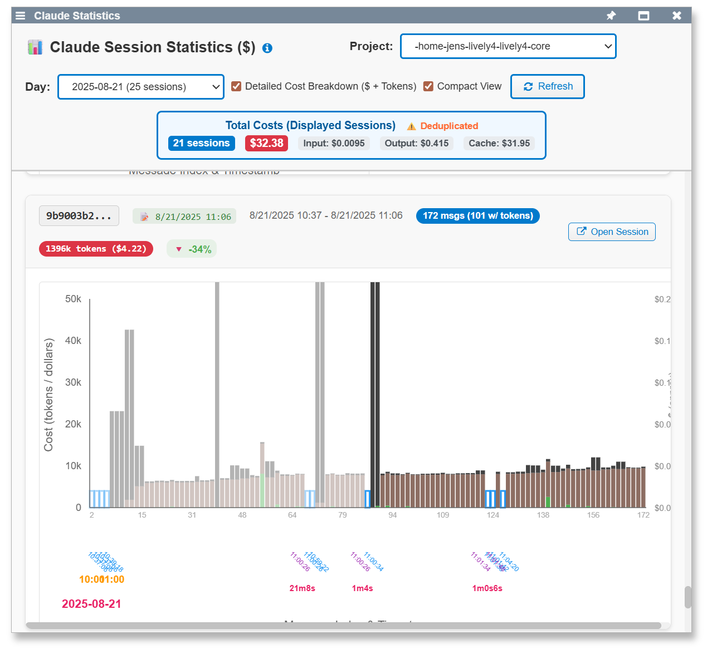
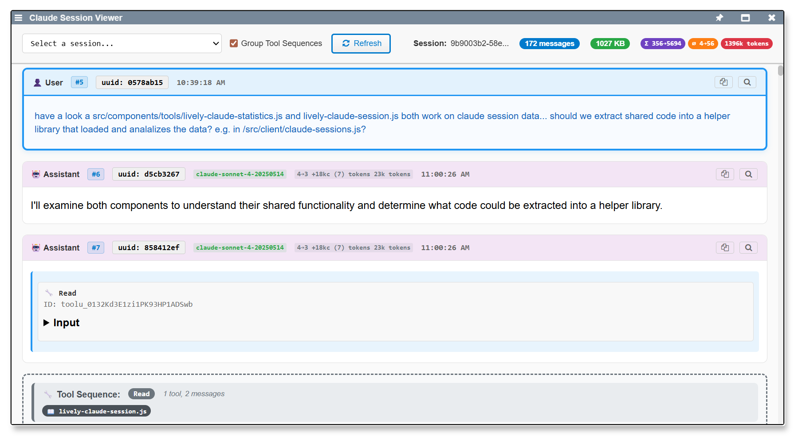

## 2025-08-22 Claude Statistics and MCP Development #statistics #mcp #analytics
*Author: @JensLincke [with @BlindGoldie]*

Major development work on Claude Code usage analytics and Model Context Protocol integration, building comprehensive statistics tracking for Claude sessions with pricing analysis and UI improvements.

- **Added**: [lively-claude-statistics.js](edit://src/components/tools/lively-claude-statistics.js), [lively-claude-statistics.html](edit://src/components/tools/lively-claude-statistics.html)
- **Modified**: [claude-sessions.js](edit://src/client/claude-sessions.js) - added pricing calculations and session analysis
- **Feature**: Complete statistics component with session grouping, cost tracking, and filtering capabilities
- **UI**: Compact view, improved layouts, color coding, and load more functionality for large datasets

**Technical details:**
- Implemented session analysis with grouping by date/model and cost calculations
- Added pricing integration for different Claude models (Haiku, Sonnet, Opus)
- Created filtering and visualization features for usage patterns
- Enhanced MCP test coverage with dedicated test files

### **LivelyClaudeStatistics** (`lively-claude-statistics.js`):
- D3.js-powered interactive charts with Claude Sonnet 4 pricing ($3-15/MTok)
- UUID-based duplicate detection and cost deduplication across sessions
- Project/day filtering with incremental loading (5 sessions initially, load-more for remaining)
- Stacked bar visualization: input/output/cache token costs with timeline progression
- Response time tracking and escalation analysis between user questions and AI responses

### **ClaudeSessionsAPI** (`claude-sessions.js`):
- Terminal-based session discovery via filesystem find commands in ~/.claude/projects
- JSONL parsing with error-tolerant message extraction
- Project filtering and session metadata (modification times, file sizes, session IDs)
- Shared terminal instance for efficient file operations across components

