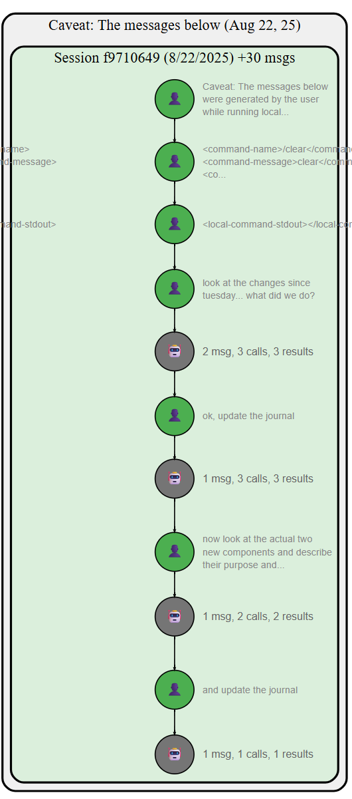
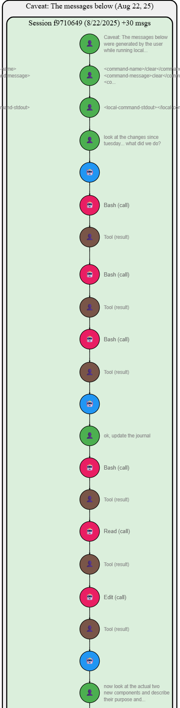

# Journal Entry: 2025-09-10 Claude Conversations

## 2025-09-10 Added Zooming Support #zooming #html-utils #claude-conversations
*Author: @JensLincke with @BlindGoldie*

Added CTRL+scroll zooming functionality to Lively4 components. Components can now be zoomed in/out using CTRL+mouse wheel.

- **Added**: [html.js](edit://src/client/html.js) - New `Zooming` class for reusable zoom functionality
- **Modified**: [lively-claude-conversations.js](edit://src/components/tools/lively-claude-conversations.js) - First component to use the new zooming feature

**Feature**: CTRL+scroll wheel zooming with configurable zoom bounds and automatic state preservation during live reloading.

## Claude Conversations Architecture Issues Identified #architecture #claude-conversations #data-model

**Issue 1: Data Pollution Causing Tree Artifacts**
- Current code modifies original data structures in-place (`conversation.abstractMessages`)
- Parent relationships get corrupted when switching abstraction levels
- Results in tree structures instead of linear chains

**Issue 2: Incorrect Session Visualization Logic**
- Code calculates "incremental" session differences instead of using actual data
- Sessions show nested boxes with wrong message counts
- Should simply use `conversation.sessionMessages.get(sessionId)` for each session

**Architecture Refactor Completed:**
- [x] #DONE Create clean separation: Raw Data (immutable) + Rendering Data (rebuilt per abstraction)
- [x] #DONE Fix session logic to trust actual session membership data
- [x] #DONE Implement `buildRenderingData(conversation, abstractionLevel)` method
- [x] #DONE Remove all in-place modifications of original data structures

## Claude Conversations Architecture Refactor Completed #refactor #clean-architecture

**Implemented clean separation of data layers:**
- **Raw Data Layer**: Original `_messages`, `_sessions`, `_conversations` (immutable)
- **Rendering Data Layer**: Clean `buildRenderingData()` creates `{nodes: [], edges: [], sessions: []}` per abstraction level
- **Graphviz Layer**: Uses only rendering data, never modifies originals

**Added**: [buildRenderingData method](edit://src/components/tools/lively-claude-conversations.js#L227) - Main entry point for clean rendering data
**Added**: [buildDetailedRenderingData](edit://src/components/tools/lively-claude-conversations.js#L245) - All messages as individual nodes
**Added**: [buildCondensedRenderingData](edit://src/components/tools/lively-claude-conversations.js#L314) - User messages + agent activity groups
**Added**: [buildAbstractRenderingData](edit://src/components/tools/lively-claude-conversations.js#L457) - Tool call/result pairs grouped
**Added**: [buildSimpleRenderingData](edit://src/components/tools/lively-claude-conversations.js#L537) - Tool messages hidden
**Added**: [buildSessionStructure](edit://src/components/tools/lively-claude-conversations.js#L290) - Actual session membership without calculations

**Removed**: Legacy `processToolGroupings`, `createAgentMessageGroups` - replaced by clean builders
**Fixed**: Session visualization now uses actual `conversation.sessionMessages.get(sessionId)` data
**Fixed**: Parent-child relationships rebuilt correctly for each abstraction level

**Result**: No more tree artifacts when switching modes, accurate session boxes, clean linear conversation chains.

 