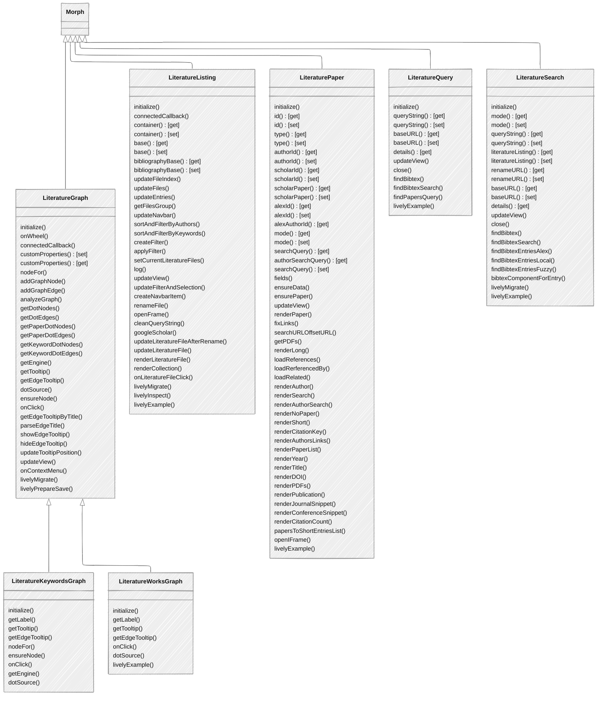

# Literature

Lively4 contains a set of components dealing with literature studies and bibliographies.

## Issues

- Since we index all markdown files, all converted papers are in full text cached in our IndexDB too. This this clunks our normal search, we have take them out there. But since we have them lying around in our index any way, we could also make use of them. E.g. by providing a local literature search that explicitly search in "_marker/" and then not only links them to the markdown file, but also the original pdf, and the also showing the right bib entry. 
- The literature-listings currently load a fresh directory listing every time, to see if files changed or get deleted, this takes a reasonably long time, because it is recursively and also includes the markdown and jpeg files etc that are not needed for building up the index. We could therefore:
  - [ ] only request pdfs, this would require a new feature in the server, e.g. find with a filter
  - [ ] always show the cached version first, but then proceed in update what is need. Most of the time there will not be many updates. 
