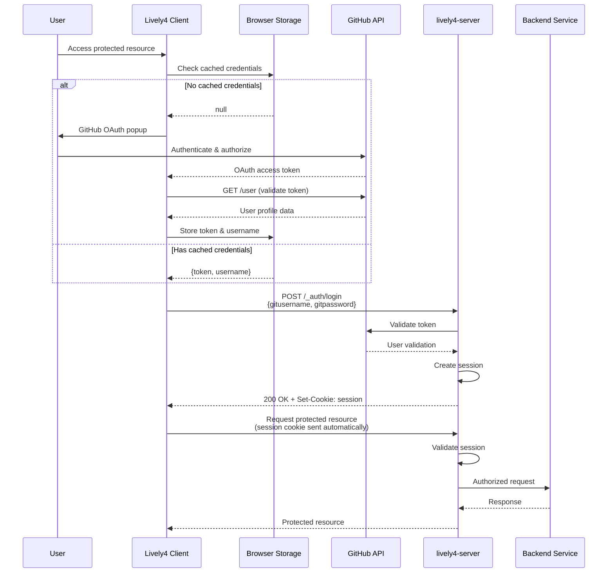

# Lively4-Server Authentication Architecture

This document describes the authentication system used by lively4-server services, using the terminal service as a primary example.

## Overview

Lively4-server uses a hybrid OAuth + Session authentication pattern that combines:
- **GitHub OAuth 2.0** for identity verification
- **HTTP session cookies** for subsequent request authentication
- **Standard browser security model** for seamless WebSocket support

This approach solves common web application authentication challenges, particularly the limitation that browser WebSocket connections cannot send custom headers.

## Authentication Flow

### Complete Authentication Sequence



## Implementation Standards

### 1. OAuth 2.0 Integration

**GitHub OAuth Flow:**
```javascript
// Client-side OAuth initiation
lively.authGithub.challengeForAuth(Date.now(), async (token) => {
  // Validate token with GitHub API
  const userResponse = await fetch("https://api.github.com/user", {
    headers: { Authorization: "token " + token }
  });
  const user = await userResponse.json();
  
  // Store credentials for reuse
  await this.storeValue("githubUsername", user.login);
  await this.storeValue("githubToken", token);
});
```

**Standards Compliance:**
- **RFC 6749** - OAuth 2.0 Authorization Framework
- **GitHub OAuth Apps** - Standard GitHub application integration
- **PKCE recommended** for public clients (future enhancement)

### 2. Session Management

**Session Establishment:**
```javascript
// Exchange OAuth token for session cookie
const loginResponse = await fetch(`${serverURL}/_auth/login`, {
  method: "POST",
  headers: {
    'gitusername': githubUsername,
    'gitpassword': githubToken
  }
});

// Server validates with GitHub and sets session cookie (from auth.js)
// Set-Cookie: lively4-session=${sessionId}; HttpOnly; Path=/; Max-Age=86400; SameSite=Lax
```

**Session Usage:**
```javascript
// All subsequent requests automatically include session cookie
const response = await fetch(`${serverURL}/_terminal/create`, {
  method: "POST"
  // No authentication headers needed - cookie sent automatically
});

// WebSocket connections also receive session cookie
const ws = new WebSocket(`ws://${serverURL}/_terminal/ws/${pid}`);
// Cookie automatically sent during WebSocket handshake
```

**Standards Compliance:**
- **RFC 6265** - HTTP State Management Mechanism (Cookies)
- **SameSite protection** against CSRF attacks
- **HttpOnly flag** prevents XSS access
- **Secure flag** for HTTPS-only transmission

### 3. Service Authorization

**Server-side Session Validation (from auth.js):**
```javascript
/**
 * Checks if the request is authorized based on GitHub credentials and team membership
 * Supports both header-based auth (existing) and session-based auth (new)
 */
async checkAuth(req, res) {
  if (this.server.options["authorize-requests"]) {
    // Try header-based auth first (existing behavior)
    var username = req.headers['gitusername'];
    var password = req.headers['gitpassword'];

    // If no header auth, try session-based auth (new feature)
    if (!username || !password) {
      const sessionAuth = this.checkSessionAuth(req);
      if (sessionAuth) {
        username = sessionAuth.username;
        logRequest(req, `AUTHORIZED BY SESSION: ${username}`);
        return true;
      }
    }

    // GitHub organization/team validation
    let teamInfo = await fetch(`https://api.github.com/orgs/${org}/teams/${teamName}`, {
      headers: { Authorization: "token " + password }
    }).then(r => r.json());
    
    // Check team membership...
    return userInTeam;
  }
  return true;
}
```

## Terminal Service Example

### Service Integration

The terminal service demonstrates complete integration with the authentication system:

**1. Session-Authenticated Endpoints:**
- `POST /_terminal/create` - Create new terminal session
- `POST /_terminal/size/:pid` - Resize terminal
- `WebSocket /_terminal/ws/:pid` - Terminal I/O connection

**2. Automatic Cookie Handling:**
```javascript
// Terminal creation (xterm component)
async function createTerminal() {
  // 1. Ensure authentication (sets session cookie if needed)
  await this.ensureAuthenticated();
  
  // 2. Create terminal - cookie sent automatically
  const response = await fetch(`${serverURL}/_terminal/create?cols=80&rows=24`, {
    method: "POST"
    // No auth headers - session cookie sufficient
  });
  
  const pid = await response.text();
  
  // 3. Connect WebSocket - cookie sent automatically  
  const ws = new WebSocket(`ws://${serverURL}/_terminal/ws/${pid}`);
  return { pid, ws };
}
```

**3. WebSocket Authentication (from terminal.js):**
```javascript
/**
 * Handle WebSocket connections to terminals
 * Authentication is handled at the HTTP upgrade level before WebSocket creation
 */
async handleWebSocket(ws, req) {
  // Extract PID from URL path
  const pidMatch = req.url.match(/\/_terminal\/ws\/(\d+)/);
  if (!pidMatch) {
    ws.close(1008, 'Invalid terminal PID');
    return;
  }

  const pid = parseInt(pidMatch[1]);
  const term = this.terminals[pid];

  if (!term) {
    ws.close(1008, 'Terminal not found');
    return;
  }

  // Forward terminal output to WebSocket with buffering
  const buffer = this.createBuffer(ws, 5);
  term.on('data', (data) => buffer(data));
  
  // Forward WebSocket input to terminal
  ws.on('message', (msg) => term.write(msg.toString()));
}
```

## Security Model

### Authentication Security

**OAuth Token Handling:**
- Tokens stored in browser local storage with domain isolation
- Tokens only sent to lively4-server for session establishment
- Server validates tokens with GitHub API before creating sessions
- Tokens can be revoked at GitHub without affecting active sessions

**Session Security:**
- Session cookies are HttpOnly (prevents XSS access)
- Secure flag ensures HTTPS-only transmission
- SameSite=Strict prevents CSRF attacks
- Server-side session storage allows instant revocation
- Sessions timeout automatically (configurable)

**WebSocket Security:**
- Session cookies automatically sent during handshake
- Connection terminated if session invalid
- No custom authentication protocol needed
- Standard browser security model applies

### Authorization Model

**GitHub Organization/Team Requirements:**
```javascript
// Server validates GitHub organization membership
const orgResponse = await fetch(`https://api.github.com/user/memberships/orgs/${orgName}`, {
  headers: { Authorization: `token ${userToken}` }
});

if (orgResponse.status !== 200) {
  throw new Error('User not member of required organization');
}
```

**Service-Level Permissions:**
- Terminal access requires GitHub organization membership
- Additional permissions can be checked per-service
- User context available in all authenticated requests

## Implementation Guidelines

### Client-Side Implementation

**1. Credential Storage:**
```javascript
// Use consistent storage prefix across services
get storagePrefix() {
  return "LivelySync_";
}

async loadValue(key) {
  return lively.focalStorage.getItem(this.storagePrefix + key);
}

async storeValue(key, value) {
  return lively.focalStorage.setItem(this.storagePrefix + key, value);
}
```

**2. Authentication Check:**
```javascript
async ensureAuthenticated() {
  // Check cached credentials
  const username = await this.loadValue("githubUsername");
  const token = await this.loadValue("githubToken");
  
  if (!username || !token) {
    // Trigger OAuth flow
    await this.authenticateWithGitHub();
  }
  
  // Establish session
  const response = await fetch(`${serverURL}/_auth/login`, {
    method: "POST",
    headers: {
      'gitusername': username,
      'gitpassword': token
    }
  });
  
  if (!response.ok) {
    throw new Error('Session establishment failed');
  }
  
  // Session cookie now set - all subsequent requests authenticated
}
```

### Server-Side Implementation

**1. Service-Level Authentication (from terminal.js):**
```javascript
/**
 * Handle HTTP requests for terminal operations
 */
async request(pathname, req, res) {
  // Check authentication using the server's auth service
  if (!await this.server.authService.checkAuth(req, res)) {
    return; // checkAuth already sent 403 response
  }

  if (pathname.match(/\/_terminal\/create/)) {
    return this.createTerminal(req, res);
  }
  
  // ... other endpoints
}
```

**2. WebSocket Authentication (from http-server.js):**
```javascript
// WebSocket endpoint for terminals with authentication check
this.app.ws('/_terminal/ws/:pid', async (ws, req) => {
  // Check authentication for WebSocket connections (session or headers)
  const dummyRes = { 
    writeHead: () => {}, 
    end: () => {} 
  };
  
  // Reuse the same auth service that handles HTTP requests
  if (!await this.authService.checkAuth(req, dummyRes)) {
    ws.close(1008, 'Authentication required');
    return;
  }
  
  // Forward to terminal service if authenticated
  this.terminalService.handleWebSocket(ws, req);
});
```

## Advantages of This Approach

### 1. Standards Compliance
- Uses well-established OAuth 2.0 for identity
- Standard HTTP session management
- Standard browser cookie security model
- No custom authentication protocols

### 2. Security Benefits
- No password storage on lively4-server
- Session cookies are more secure than tokens in headers
- Automatic CSRF protection with SameSite cookies
- Sessions can be revoked without affecting OAuth tokens
- GitHub handles all identity security

### 3. Developer Experience
- WebSocket authentication "just works"
- No custom headers needed after initial login
- Shared credentials across all lively4-server services
- Standard browser behavior (logout clears all sessions)

### 4. Scalability
- Session storage can be moved to Redis for clustering
- OAuth tokens only validated during session establishment
- Reduced GitHub API calls (not on every request)
- Session validation is fast (local lookup)


## Standards References

- [RFC 6749 - OAuth 2.0 Authorization Framework](https://tools.ietf.org/html/rfc6749)
- [RFC 6265 - HTTP State Management Mechanism](https://tools.ietf.org/html/rfc6265)
- [RFC 6455 - WebSocket Protocol](https://tools.ietf.org/html/rfc6455)
- [GitHub OAuth Apps Documentation](https://docs.github.com/en/developers/apps/building-oauth-apps)