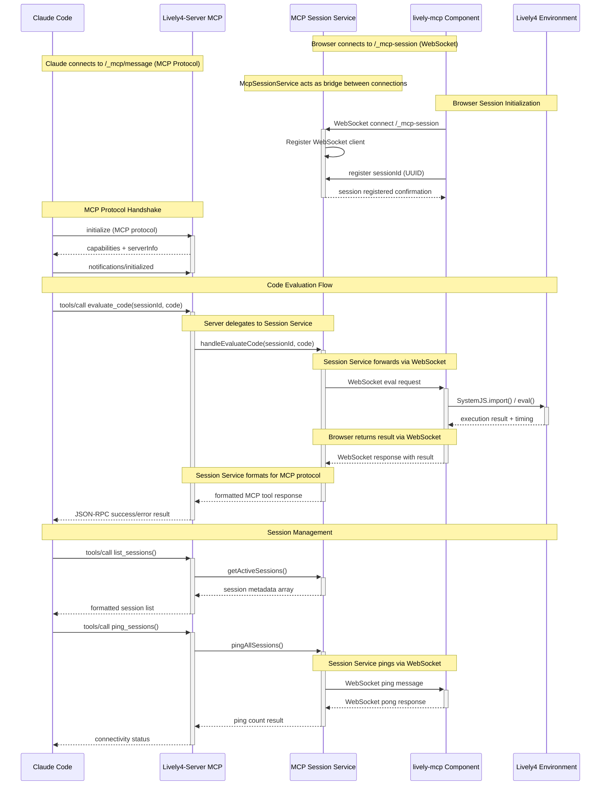

# MCP (Model Context Protocol) Integration

This document describes the complete MCP integration implementation for Lively4, enabling Claude Code to interact directly with live browser environments through a sophisticated dual-connection architecture.

## Overview

The Lively4 MCP integration provides a bridge between Claude Code and live development environments, enabling:

- **Real-time code evaluation** in browser sessions via SystemJS
- **Multi-user session isolation** with UUID-based targeting
- **Direct component manipulation** and DOM interaction
- **Live debugging and development assistance** with immediate feedback
- **WebSocket-based communication** for low-latency responses

## Quick Start

1. **Open browser session:**
   - Navigate to `http://localhost:9005` (default Lively4 server)
   - Open MCP component: Right-click → Tools → MCP

2. **Configure Claude Code:**
   Add to your MCP server configuration:
   ```json
   {
     "mcpServers": {
       "lively4": {
         "url": "http://localhost:9005/_mcp/message"
       }
     }
   }
   ```

3. **Test with Claude Code:**
   Simply use `evaluate_code` to run JavaScript - it will auto-select the available session!

## Architecture

### Dual-Connection Design

The implementation uses two separate communication channels:

1. **Browser ↔ Server** (WebSocket at `/_mcp-session`)
   - Session registration and management
   - Code evaluation requests and responses
   - Real-time bidirectional communication
   - Connection monitoring and recovery

2. **Claude Code ↔ Server** (MCP Protocol via HTTP at `/_mcp/message`)
   - Standard MCP tools interface
   - Session targeting for multi-user support
   - JSON-RPC message handling
   - Tool execution and response formatting

### Implementation Components

- **`lively-mcp` component** (Browser): Visual agent avatar with session management
- **`Lively4McpServer`** (Server): Manual MCP protocol implementation
- **`McpSessionService`** (Server): WebSocket session registry and request correlation
- **HTTP Integration** (Server): MCP endpoint integration with existing Lively4 server



## MCP Protocol Implementation

### Server Architecture

#### `Lively4McpServer` 
Manual MCP protocol implementation without SDK dependencies:

**File:** [../lively4-server/src/services/mcp-server.js](edit://../../lively4-server/src/services/mcp-server.js)

**Features:**
- JSON-RPC 2.0 message handling
- HTTP transport integration with Express
- Tool registration and execution framework
- Error handling and validation
- Session correlation with WebSocket service

#### `McpSessionService`
WebSocket session management service:

**File:** [../lively4-server/src/services/mcp-session.js](edit://../../lively4-server/src/services/mcp-session.js)

**Features:**
- Multi-client connection handling
- UUID-based session isolation
- Request/response correlation with timeouts
- Connection monitoring and recovery
- Bidirectional message routing

### Available MCP Tools

#### `evaluate_code`
Execute JavaScript code in a Lively4 browser session. Automatically selects an available session if sessionId is not provided.

**Input Schema:**
```json
{
  "type": "object",
  "properties": {
    "sessionId": {
      "type": "string",
      "description": "Target Lively4 session ID (optional - auto-selects if not provided)"
    },
    "code": {
      "type": "string", 
      "description": "JavaScript code to evaluate in the live environment"
    },
    "timeout": {
      "type": "number",
      "description": "Timeout in milliseconds (default: 30000)",
      "default": 30000
    }
  },
  "required": ["code"]
}
```

**Session Selection Logic:**
- **No sessionId provided**: Auto-selects available session
- **Exactly 1 session**: Uses it automatically  
- **0 sessions**: Returns error with setup instructions
- **Multiple sessions**: Returns error with session list for manual selection

**Evaluation Capabilities:**
- JavaScript evaluation via `boundEval()` with proper SystemJS integration
- Module imports and workspace management
- Async/await support for Promise-based code
- Automatic result serialization (objects → JSON)
- Error capture and formatted error messages

**Example Usage:**
```javascript
// Simple usage - auto-selects session
evaluate_code({ code: "lively.notify('Hello!')" })

// Explicit session targeting
evaluate_code({ 
  sessionId: "abc123...", 
  code: "lively.notify('Hello from specific session!')" 
})

// Complex operations
evaluate_code({ 
  code: `
    const windows = Array.from(document.querySelectorAll('lively-window'))
    windows.map(win => win.getAttribute('title'))
  `
})
```

#### `list_sessions`
List all active Lively4 browser sessions available for code execution.

**Returns:** Formatted text with session information:
```
Found 2 active Lively4 session(s):

Session ID: 3172388d-08b9-4f42-9898-130198ee7c3a
Registered: 2025-08-15T08:45:22.644Z
Connected: true
User Agent: Mozilla/5.0...

---

Session ID: f7d2c1a8-9b3e-4f56-a2d1-8c9e7f6d5a4b
Registered: 2025-08-15T09:12:15.332Z
Connected: true
User Agent: Mozilla/5.0...
```

#### `ping_sessions`
Ping all active sessions to check connectivity and clean up stale connections.

**Returns:** Connectivity status summary:
```
Pinged 2/3 sessions successfully
```

## Browser Component: `lively-mcp`

The visual MCP agent component provides the browser-side interface for the MCP integration.

**Files:**
- [src/components/tools/lively-mcp.js](edit://src/components/tools/lively-mcp.js) - Component implementation
- [src/components/tools/lively-mcp.html](edit://src/components/tools/lively-mcp.html) - Component template

**Open Component:**
```javascript
// In browser console or via Claude Code MCP
lively.openComponentInWindow('lively-mcp')
```

### Features
- **Visual MCP Agent**: User-friendly interface showing connection status and session ID
- **Session Management**: Automatic UUID generation and WebSocket connection
- **Activity Logging**: Real-time display of MCP requests and responses with timestamps
- **Code Execution**: SystemJS-based evaluation with error handling and result display
- **Connection Recovery**: Automatic reconnection with exponential backoff

### Component Lifecycle
1. **Initialization**: Generate UUID, connect to WebSocket endpoint
2. **Registration**: Send session metadata to server
3. **Active Phase**: Handle evaluation requests, log activity
4. **Migration**: Preserve session state during component updates
5. **Cleanup**: Close connections on component destruction

### WebSocket Message Protocol

**Browser → Server Messages:**
```json
// Session registration
{
  "type": "register-session",
  "sessionId": "uuid-generated-by-browser",
  "timestamp": "2025-08-15T10:30:00.000Z"
}

// Evaluation result
{
  "type": "evaluation-result", 
  "requestId": "req-uuid",
  "sessionId": "session-uuid",
  "success": true,
  "result": "42",
  "timestamp": "2025-08-15T10:30:05.123Z"
}

// Keep-alive response
{
  "type": "pong",
  "sessionId": "session-uuid",
  "timestamp": "2025-08-15T10:30:10.456Z"
}
```

**Server → Browser Messages:**
```json
// Code evaluation request
{
  "type": "evaluate-code",
  "requestId": "req-uuid",
  "code": "2 + 2",
  "timestamp": "2025-08-15T10:30:00.000Z"
}

// Connection monitoring
{
  "type": "ping",
  "timestamp": "2025-08-15T10:30:00.000Z"
}
```

## Common Use Cases

### Development Assistance
- Inspecting component state and DOM structure
- Testing code snippets in live environment
- Debugging component lifecycle and events
- Validating CSS and styling changes

### Component Interaction
- Creating and configuring Lively4 components
- Manipulating window layouts and positioning
- Testing component methods and properties
- Exploring component relationships

### File Operations
- Loading and inspecting file contents
- Testing module imports and dependencies
- Validating file system operations
- Checking component template loading

## Integration Examples

### Window Management
```javascript
// List all open windows
const windows = Array.from(document.querySelectorAll('lively-window'))
  .map(win => ({
    title: win.getAttribute('title'),
    position: win.style.transform,
    component: win.querySelector('[data-lively4-objectname]')?.tagName
  }))

// Focus specific window
const targetWindow = document.querySelector('lively-window[title*="MCP"]')
if (targetWindow) targetWindow.focus()
```

### Component Exploration
```javascript
// Find component by name
const component = await lively.components.loadByName('lively-xterm')

// Inspect component methods
Object.getOwnPropertyNames(component.prototype)
  .filter(name => name.startsWith('on') || name.includes('send'))

// Test component functionality
const instance = await lively.create('lively-xterm')
instance.sendCommand('echo "Hello from MCP"')
```

### Development Workflow
```javascript
// Hot reload module during development
await lively.reloadModule('/templates/lively-xterm.js')

// Check component registration
lively.components.getTemplatePaths()
  .filter(path => path.includes('xterm'))

// Validate component loading
const loaded = await lively.components.loadByName('lively-xterm')
console.log('Component loaded:', !!loaded)
```

## HTTP Endpoints

### MCP Protocol Endpoints
- `POST /_mcp/message` - JSON-RPC 2.0 message handling
- `GET /_mcp/message` - SSE stream support (not implemented)

### Management Endpoints  
- `GET /_mcp/status` - Server status and session information
- `GET /_mcp/sessions` - List active sessions with metadata
- `POST /_mcp/ping-sessions` - Ping all sessions for connectivity check

### WebSocket Endpoints
- `/_mcp-session` - Browser session registration and communication

## Error Handling

### MCP Protocol Errors
Standard JSON-RPC error codes with detailed messages:

```json
// Invalid protocol version
{
  "jsonrpc": "2.0",
  "error": {
    "code": -32602,
    "message": "Invalid protocol version"
  },
  "id": "request-id"
}

// Tool execution failure
{
  "jsonrpc": "2.0", 
  "error": {
    "code": -32603,
    "message": "Tool execution failed: ReferenceError: foo is not defined"
  },
  "id": "request-id"
}
```

### Session Management Errors
- **Session not found**: Invalid or expired session ID
- **Connection timeout**: WebSocket connection lost
- **Evaluation timeout**: Code execution exceeds configured limit (30s default)
- **WebSocket errors**: Connection failures, message parsing errors

### Code Evaluation Errors
- **JavaScript syntax errors**: Invalid code syntax
- **Runtime exceptions**: Errors during code execution
- **Import failures**: Module loading errors with SystemJS
- **Security restrictions**: CORS, CSP, or permission errors

All errors include:
- Detailed error messages
- Execution timing information
- Session context for debugging
- Stack traces when available

## Security Considerations

- Code execution happens in the browser's JavaScript context
- Same-origin policy restrictions apply to cross-domain operations
- Sessions are isolated and require explicit session ID targeting
- All code execution is logged and traceable

## Troubleshooting

### Session Connection Issues
1. Verify Lively4 is running and accessible
2. Check browser console for WebSocket connection errors
3. Confirm MCP server is properly configured

### Code Execution Failures
1. Test code manually in browser console first
2. Check for typos in component names or API calls
3. Verify required modules are loaded
4. Use shorter timeouts for debugging

### Component Not Found Errors
1. Confirm component is registered: `lively.components.getTemplatePaths()`
2. Check template file paths and naming conventions
3. Verify component initialization and loading

## Configuration and Deployment

### Claude Code MCP Configuration

**For HTTP Transport:**
```json
{
  "mcpServers": {
    "lively4": {
      "url": "http://localhost:9005/_mcp/message"
    }
  }
}
```

### Browser Setup
1. Navigate to Lively4 server (http://localhost:9005)
2. Open MCP component: `lively.openComponentInWindow('lively-mcp')` or Right-click → Tools → MCP
   - See [lively-mcp component](edit://src/components/tools/lively-mcp.js) for implementation details
3. Component displays connection status and session ID
4. MCP agent ready for Claude Code interaction

**Component Documentation:**
The `lively-mcp` component includes comprehensive inline documentation with:
- Architecture overview and sequence diagram
- WebSocket protocol details  
- Code evaluation capabilities
- Session management features

View the component's built-in documentation by opening it in the browser.

## Testing and Validation

### MCP Protocol Test
For testing the MCP protocol implementation directly (mainly for development/debugging):

**File:** [../lively4-server/test/mcp-protocol-test.js](edit://../../lively4-server/test/mcp-protocol-test.js)

```bash
cd lively4-server
node test/mcp-protocol-test.js
```

**Note:** This test is primarily for development purposes. For normal usage, the visual `lively-mcp` component provides a better interface for testing and monitoring MCP functionality.

### Manual Testing
```javascript
// In browser console or via MCP
lively.openComponentInWindow('lively-mcp')

// Verify session registration
console.log('Session active:', !!window.mcpSessionId)

// Test component interaction
const windows = Array.from(document.querySelectorAll('lively-window'))
console.log('Active windows:', windows.length)
```

## Security Considerations

- **Session isolation**: UUID-based targeting prevents cross-session interference
- **Browser sandbox**: Code execution within existing browser security context
- **No elevated permissions**: Uses standard Lively4 API access levels
- **Connection encryption**: HTTPS/WSS support for production deployments
- **Request validation**: JSON-RPC message validation and sanitization
- **Timeout protection**: Prevents infinite loops and resource exhaustion

## Future Enhancements

- **Persistent evaluation contexts**: Variable scopes that persist across evaluations
- **Sandboxed execution**: Enhanced security with isolated execution environments
- **File system integration**: Direct file editing and template generation
- **Component scaffolding**: Automated component creation and boilerplate
- **Multi-session coordination**: Cross-session communication and synchronization
- **Enhanced debugging**: Breakpoint support and step-through debugging
- **Performance monitoring**: Execution timing and resource usage tracking
- **Authentication**: User-based session management and access control