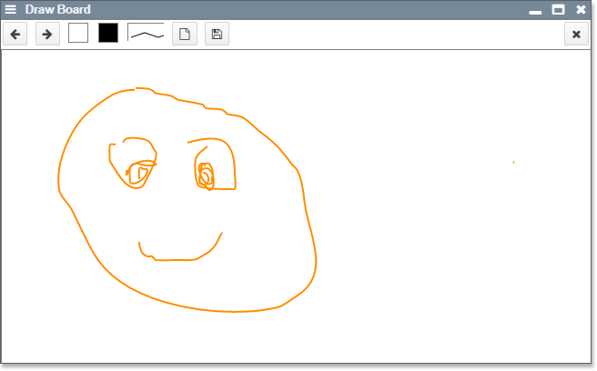

<!-- markdown-config presentation=true -->

<!-- #TODO make style links in container content relative to url -->
<!-- <link rel="stylesheet" type="text/css" href="style.css" /> -->
<link rel="stylesheet" type="text/css" href="./style.css"  />
<link rel="stylesheet" type="text/css" href="../../src/client/lively.css"  />
<link rel="stylesheet" type="text/css" href="../../templates/livelystyle.css"  />

<!--

-->

  Lively 4 Tools and Workflows

  Jens Lincke, Stefan Ramson, Robert Hirschfeld

  2019 
   
  Software Architecture Group  Hasso Plattner Institute  University of Potsdam, Germany

---

# Contents

---
# Motivation

- Collaborative Self-supporting Development Environment
  - Web-Technologoies: HTML and JavaScript (Vanilla, but bleeding edge)
- What is Lively4
  - Environment
  - Tools
  - Workflow

---
# Tools
##  Standard Tools

- [Workspace](browse://doc/presentation/workspace.html)   {style="width:300px"}
- Inspector
- Browser
- Search
  - Server-side regex search
  - Client-side search in FileIndex (IndexDB)
- Test Runner
- Context Menu 
- Github Sync

---
## Object Tools

- Halos
  - Drag and Drop
  - Copy
- #StyleEditor
- #ComponentBin
- Object Script Editor
  - Instance-specific Behaviors (similar to Parts in Webwerkstatt)
- #Drawboard (#Pen)

---
## Experimental Tools

- #XRay 
- Generic Object Graph (#WIP)
- Module Dependencies 
- Boot / Loading Visualization (more domain specific that Chrome's standard tool)
- Knot, Triple, ...
- #ASTExplorer
- Babylonian Programming Editor
- #Bibtex
- #ContinousEditor
- #LivelyFilesystems (mounting external Web-resources)
- #Vivide

---
# Lively Server

- (Terminal)

---
# Service Worker

- Caching
- Mounting Web-services

---
# Host Tools (Chrome)

Even though we experimented with using our own Console and Debugger, we struggled to implement a self-supporting debugger inside of Lively4 using the chrome debugger API. We succeeded in allowing to debug a second tab or window, but at that point we can also use the default debugger. 

- #Debugger
- #Console

--- 
# Seminar Demos

- #Blockchain
- #CloudScripting
- #GithubExplorer
- Simulated Annealing
- Semantic Soruce Code Navigator
- #Services
- #Whyline

---
# Demos

- #BouncingBall
- #SoapBubble

--- 

## Experimental Language Features

- Technology: Babel Source Code Transformation
- #ActiveExpressions
- #PolymorphicIdentifier
  - [poid.js](browse://src/client/poid.js)

---
# Components

## Widgets:
- #Connector
- #CrayonColors
- #Dialog
- #Menu
- Separator
- Script

---
## Text Editing:

### [LivelyCodeMirror](open://lively-code-mirror)
{style="width:300px; float: right; margin-left: 50px"} {style="list-style-type: none;"} 
  - powerfull editor of a text buffer
  - syntax highlighting and code completion
  - custom widgets and editor UI enhancements

### [LivelyEditor](open://lively-editor) 
{style="width:200px; float: right; margin-left: 100px"} {style="list-style-type: none;"} 
  - can edit files (urls)
  - can resolve conflicts with server and other editors
  - threewaymerge 
  
  
---
## Lively Content:
- #LivelyMarkdown {style="width:200px"} {.box}
- #LivelyPresentation {style="width:200px"} {.box}
- #LivelyEssay {.box}
- #PDF [seminar](https://lively-kernel.org/lively4/lively4-seminars/WebDev2017/project_3/index.md) {style="width:200px"} {.box}
- #Table {style="width:200px"} {.box} 
- #LivelyDrawboard {style="width:200px"} {.box} 
---
## UI Components

- #LivelyError     {.box}
- #LivelyNotification     {.box}
- #LivelyProgress     {.box}
- #LivelyPrompt    {.box}
- #LivelyConfirm    {.box}

---
## #D3 Visualizations
  
- #D3TreeMap   [{style="width:300px"}](../../demos/visualizations/treemap_size.md) {.box}
- #D3RadialTree   {style="width:300px"} {.box} 
- #D3Barchart   {style="width:300px"} {.box} 
- #D3Boxplot   {style="width:300px"} {.box}
- #D3BundleView   [{style="width:300px"}](../../demos/visualizations/bundleview.md) {.box}
- #D3PolymetricView   [{style="width:300px"}](../../demos/visualizations/polymetricview.md) {.box}

---
## #Graphviz (with D3)

- Interactive Object Graph   [{style="width:300px"}](../../demos/visualizations/object_graph.md)

---
# Research Paper 

- Babylonian Programming
- Live Programming Web-components

## Drafts

- [COP Promises](<https://lively-kernel.org/lively4/overleaf-cop18-promises/content/implementation.md>)
  - #Aysnc #COP with #Promises and syntax support
  - #LiterateProgramming / #ActiveEssay Library / Environment

---
# Applications

## Live Remote Programming Environment for Pi

- Source Code editing of Python files
- Python Terminal 
- Live DoIts and PrintIts from Editor

## Media Browser

- #Plex Media API [plex-media](open://plex-media)

## Chrome Extension

- Load Lively4 on any Web-page
- Some features are not supported 
  - e.g. booting without service worker is slow

---
# Workflows

- Editing source code in #CodeMirror
  - Modules are updated 
  - Templates are updated
    - Elements in DOM are migrated to get live feedback #LiveProgramming
      - feedback even on changes in templates and `initialize` methods
      - problem: object identities changes #FutureWork
- Inspecting DOM Elements
  - changing attributes of a DOM element in #Inspector, (similar to #Chrome tools)
- File Searching (server vs. client)
- Creating Presentations
- Creating Active Essays
- Editing Python source code 
  - Running Python programs #Terminal
  - Using #PrintIt and #DoIt in #CodeMirror
- Drawing Sketch with a #Pen

---
## Essay

- [ContextJS Paper Draft / Implementation](https://lively-kernel.org/lively4/overleaf-cop18-promises/content/implementation.md)   {style="width:500px"}

---
## Paper Writing

- writing markdown (directly include in LaTeX)  {style="width:500px"}

---
# Features

- #Windows
  - vs. pure pane and tab layout of typical websites 
- #Markdown
  - bundles (directory with index.md and linked content) #LivelyContainer

## UI

- Expose   {style="width:300px"}

---
# Documentation

- [User stories](../stories.md)
- [Developer Journal](../journal/index.md)

## Misc

- [Journal Entry: Loose Ends](../journal/2018-08-23.md)

---
# Open Questions

## Transient Objects / #ObjectIdentity?

How to bridge persistent text and transient objects? E.g. an open inspector in a self-contained squeak image is easy to persist, but the object the inspector inspected is gone when it is loaded again. Should it point to the next best similar object, or even the object the user takes to be the same object after loading? How to treat object identity? Is the `document.body` object  always the same? 

We experimented with making object identity explicit when opening tools on them. But this would change an object the moment we look at them! We would kill the cat in Heisenberg terms on a very macro level. 

--- 
# Related Work

- Lively Kernel 
  - #Webwerkstatt 
  - #LivelyWeb
  - #LivelyNext

---
##  Lively Kernel

### Missing in Lively4
- full featured #PartsBin and corresponding workflow
- Lively Bindings: connections over changes in properties
- Structured System Browser (Editing Modules/Class/Methods vs. Directories/Files)

### Alternative 

- Richtext editing vs. Markdown editing (with editing in HTML View)
- Object serialization vs. Document serialization
  - Objects vs. DOM Elements are dominant and persistent structure 
- Parts based core UI vs. Component based UI

--- 
# Future Work

- Loading is not optimized
  - lots of source code transformation while loading
  
---
## #Meta

- How to navigate inside a presentation?

---
<!-- #TODO pull this up into presentation? -->

