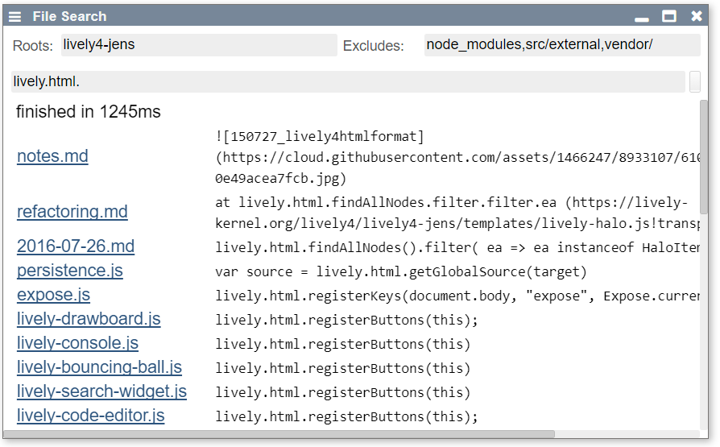

# Search

Search files ([indexed in local indexDB](../files/)). Can be disabled via

When using the local index is disabled, the search will fall back to a "grep" based server version. 

{width=400px}

