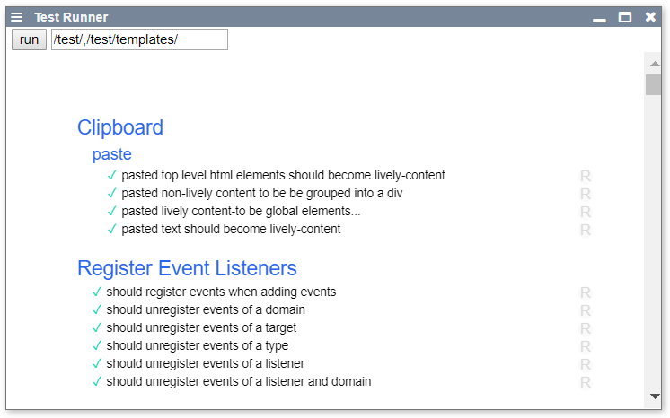

# Test-Runner

[html](edit://src/components/tools/lively-testrunner.html) | [js](edit://src/components/tools/lively-testrunner.js) | [open](open://lively-testrunner)

We use [Mocha](https://mochajs.org/) to [test](../../test/index.md) some of our [components](../../test/templates/index.md). Those tests are run by [Karma](https://karma-runner.github.io/latest/index.html) on [travis](https://travis-ci.org/LivelyKernel/lively4-core) .

{width=400px}

 
