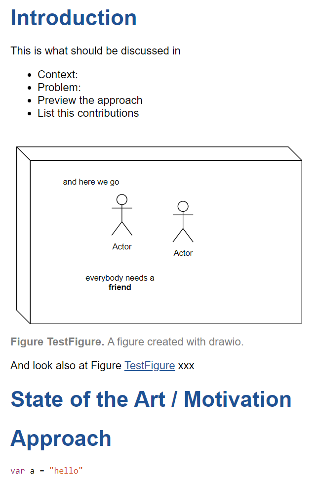
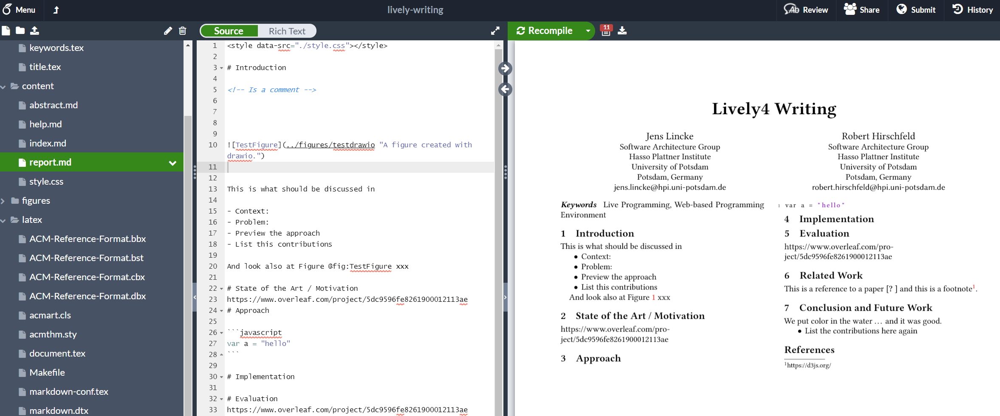

# Paper

- Latex has support for writing content in Markdown. Together with Overleaf, we can therefore use lively to write papers. The same text can therefore be used for "online" or interactive media and for producing a pdf. 

- [template](https://lively-kernel.org/lively4/swalab_markdown-paper-template/figures/)
- [lively-writing #private](https://lively-kernel.org/voices/lively-writing/README.md)

## Workflow

- create GitHub (private) repository
- checkout repository in Lively4
  - edit markdown here 
  - play with "script" tags
  - add figures through draw.io
    - edit in window frame or tab
    - manually generate pdf through context menu
  - use sync tool to update
- checkout repository in Overleaf
  - configure lua and location document.tex
  - editor markdown there and see rendered pdf
  - push/pull changes through menu
  
**In  Lively4** 

{width=200} 

**In  Overleaf**

{width=600}