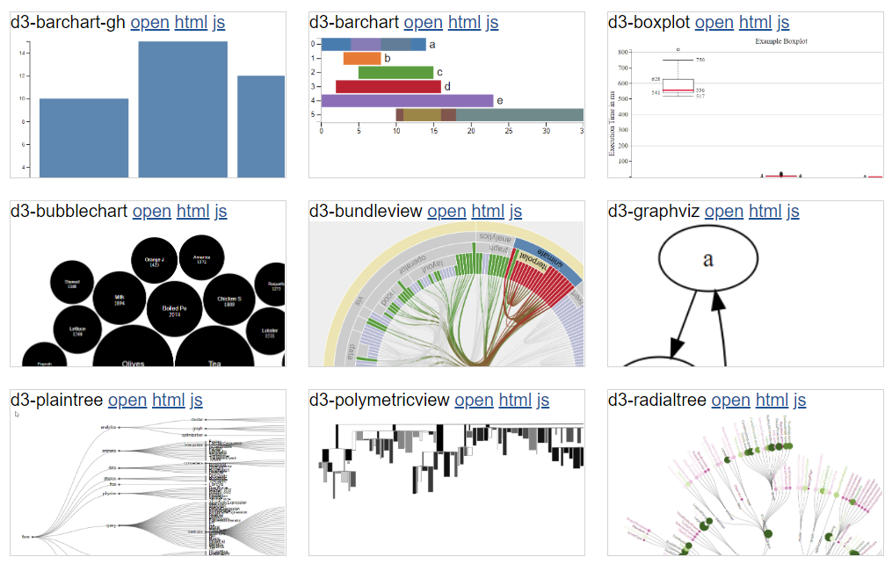

# Visualizations

[demos](../../demos/visualizations/index.md)

Lively provides various ways to create visualizations. They are usually embedded as `script` content in markdown pages. There the author can make use of more or less ready to use components that just need some configuration and filling with data, or the authors have to do everything themselves.

## [D3](../../src/components/d3/index.md) Components
{width=600px}


## GraphViz

- [GraphViz](edit://src/components/d3/graphviz-dot.js)


## Script Contents

META: #PaperTopic?

Since we currently do not support global async/await we have to wrap our visualization code in an anonymous immediate async function evaluation  (A). Inside that function we are now free to use any custom component (B), load data (C) and return the visualization, so it gets displayed in the markdown document in place of the script. All content returned from a script is displayed if not null. Promise are awaited and displayed later. 

```markdown
<script>
(async () => {                                                           // (A)
  var viz = await (<my-viz-component></my-viz-component>)                // (B)
  viz.setData(await fetch("http://mydata.org/foo").then(r => r.json()))  // (C)
  return viz                                                             // (D)
})()
</script>
```

### Related Work

- <https://observablehq.com/>