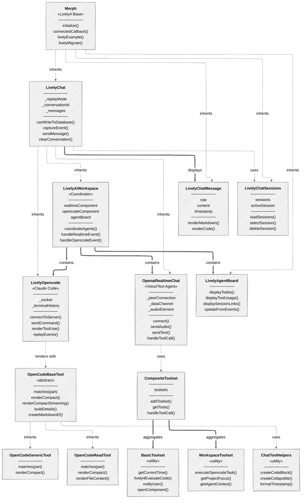

# Components

<link rel="stylesheet" type="text/css" href="../../components/index-style.css"  />
<lively-import src="../_navigation.html"></lively-import>

## Component Architecture

- lively-opencode {.component}
- lively-agent-board  {.component}
- lively-ai-workspace  {.component}
- lively-chat-message  {.component}
- lively-chat-sessions  {.component}
- openai-realtime-chat  {.component}

