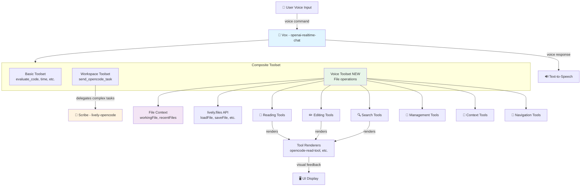
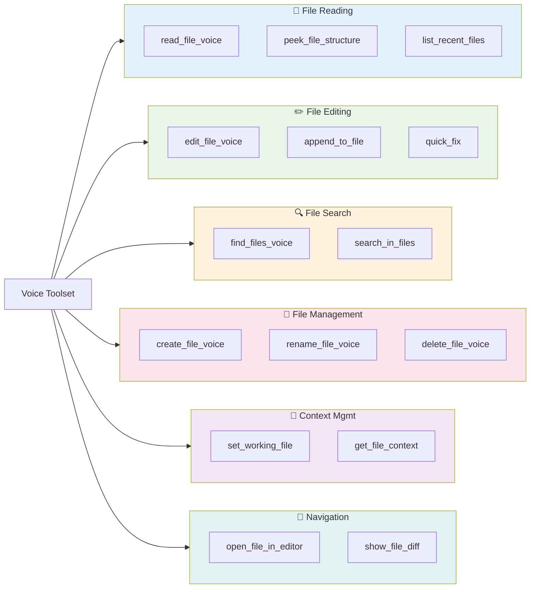
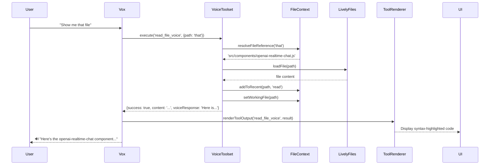
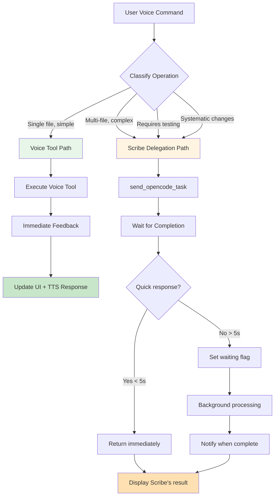
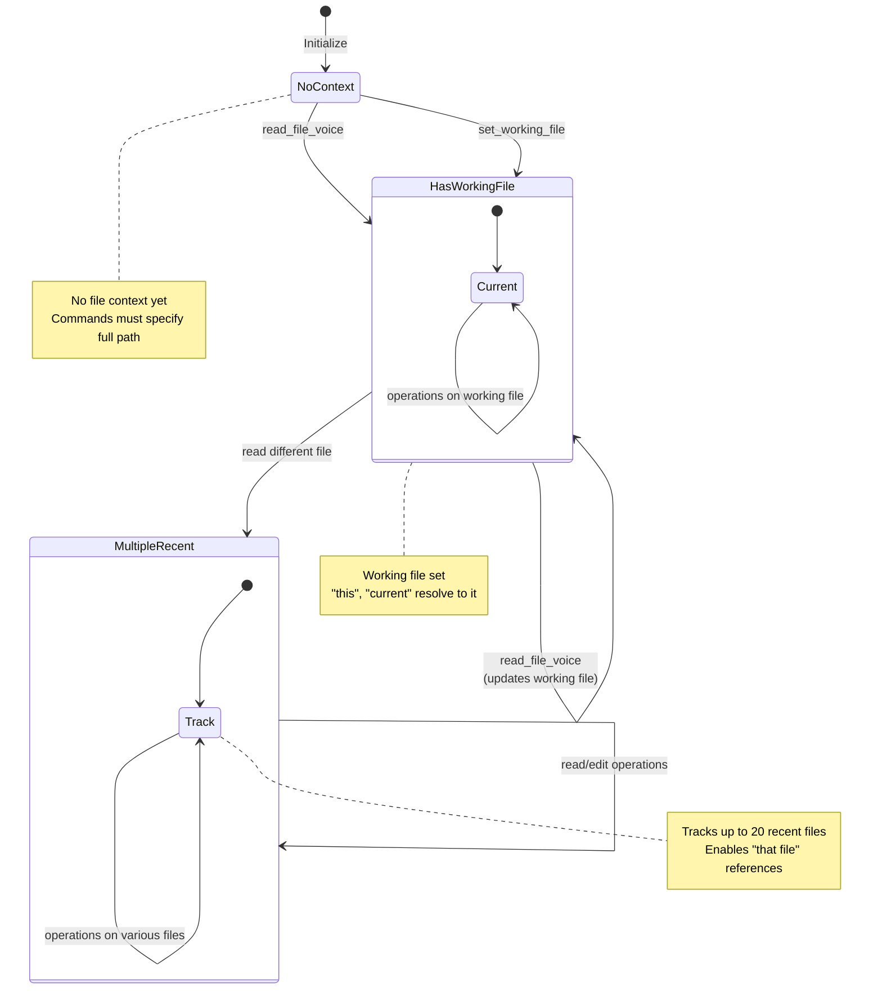
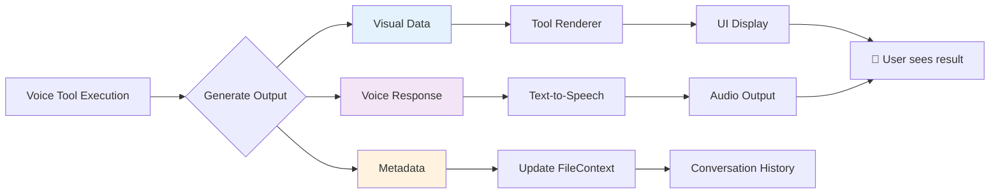
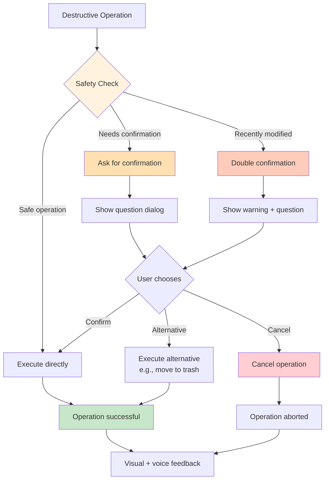
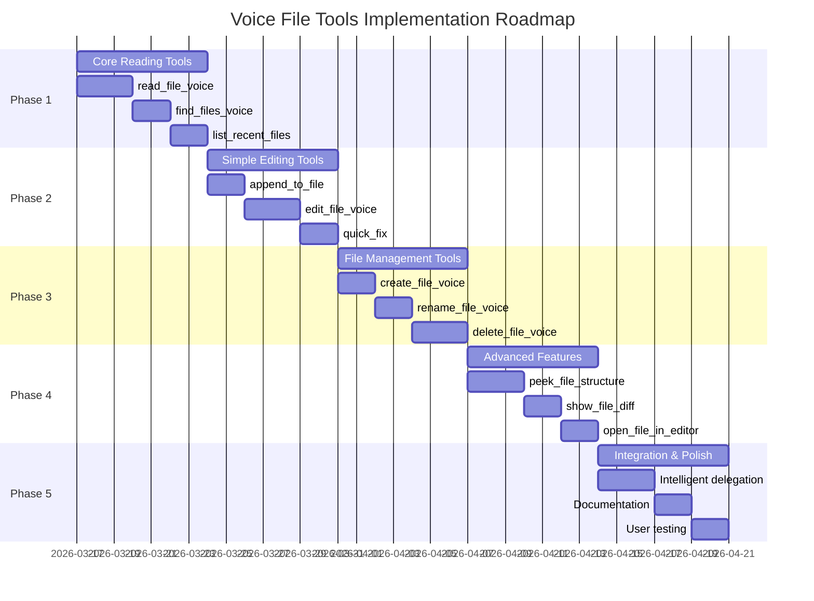

# Voice File Tools - Architecture Diagram

## System Architecture

## Tool Categories Detail

## Data Flow: Voice Command → Execution

## Decision Flow: Voice vs. Scribe

## FileContext State Machine

## Tool Output Flow

## Safety Confirmation Flow

## Implementation Phases

---

## Key Design Principles

### 1. Voice-First Design
- Natural language command understanding
- Fuzzy matching for dictation errors
- Conversational file references ("that file", "this one")
- Voice-friendly confirmation flows

### 2. Immediate Feedback
- Quick operations execute directly (no delegation)
- Visual feedback while speaking response
- Progress indicators for longer operations
- Clear success/error messages

### 3. Safety First
- Confirmations for destructive operations
- Extra checks for recently modified files
- Diff preview before applying edits
- Undo via conversation history

### 4. Context Awareness
- Track working file and recent files
- Resolve conversational references
- Maintain operation history
- Enable natural follow-up commands

### 5. Intelligent Delegation
- Simple operations → Voice Tools
- Complex operations → Scribe
- Clear handoff with explanation
- Seamless return of results

---

## Technology Stack

- **Voice Input**: OpenAI Realtime API (WebRTC)
- **File Operations**: `lively.files.*` API
- **Tool Framework**: Toolset pattern (Basic, Workspace, Voice)
- **Rendering**: OpenCode tool renderers + custom voice renderers
- **State Management**: FileContext class
- **Diff Visualization**: diff-match-patch library
- **UI Framework**: Lively4 web components
- **Testing**: Mocha + Karma

---

**See full details:**
- [Complete Plan](vox-file-tools-plan.md)
- [Quick Reference](vox-file-tools-outline.md)
