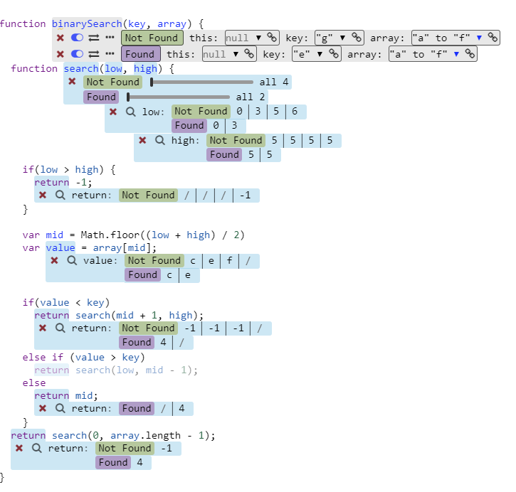
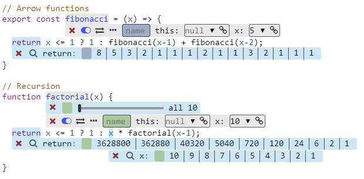
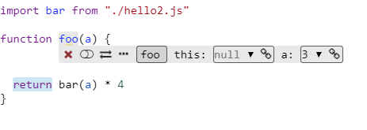
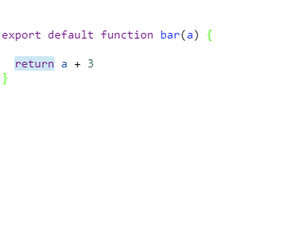
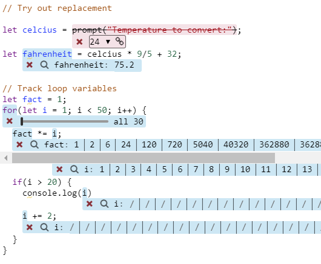
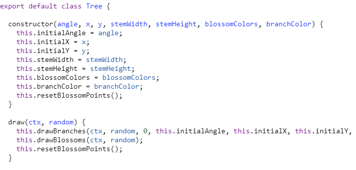

<link rel="stylesheet" type="text/css" href="../../components/index-style.css"  />

# Demos

- [binary-search-recursive.js](binary-search-recursive.js)  {.component}
- [binary-search.js](binary-search.js)  {.component}
- [classes.js](classes.js)  {.component}
- [empty.js](empty.js)  {.component}
- [functions.js](functions.js)  {.component}
- [hello.js](hello.js)  {.component}
- [hello2.js](hello2.js)  {.component}
- [script.js](script.js)  {.component}
- [tree-base.js](tree-base.js)  {.component}
improved.js) {.component}
- [tree-scene.js](tree-scene.js)   {.component} 

- [presentation/](presentation/)
  - [01_binary_search.js](presentation/01_binary_search.js)
  - [02_person.js](presentation/02_person.js)
  - [03_canvas_simple.js](presentation/03_canvas_simple.js)
  - [04_canvas_improved.js](presentation/04_canvas_improved.js)
- [benchmark/](benchmark/)
- [canvas/](canvas/)
  - [demo.js](./canvas/demo.js)
  - [example-canvas.js](./canvas/example-canvas.js)
- [todo/](todo/)

<!-- #TODO add support for thumbnail links to non components */

