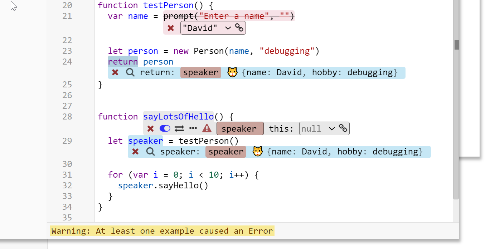
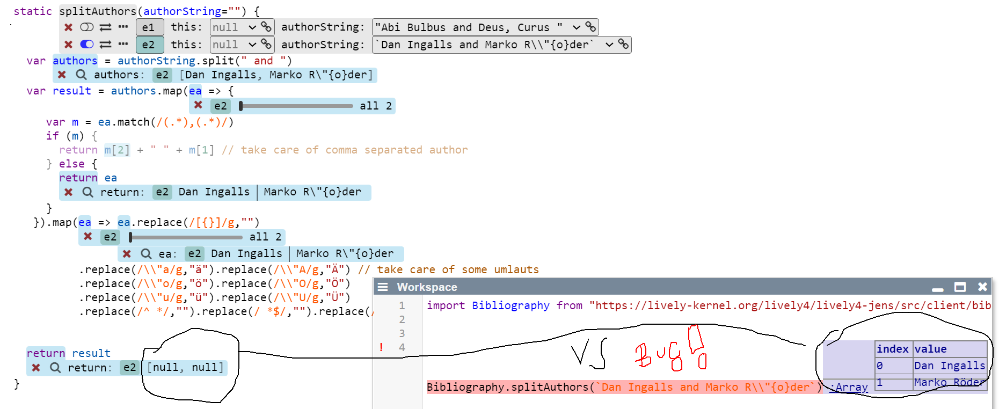

# Babylonain Programming

## Notes

### Design Bug. 

*Denn nur wenn man andere module direkt einbindet wird geschaut ob man eine intstrumentierte version davon hat. Wenn das indirekt funktioniert geht das nicht. Babylonian Programming hängt sich nämlich nicht global oder mit ContextJS in SystemJS rein sondern rewritetd die import statements.* #TODO #BabylonianProgramming

<edit://src/babylonian-programming-editor/utils/ast.js>

```javascript
await Promise.all(importNodes.map(async (node) => {
    // Turn imports into absolute URLs so they work in the temporary workspace
    const importSource = node.source.value;
    const importUrl = await System.resolve(importSource, ast._sourceUrl);
    // Set either the real or the replacement URL
    if(replacementUrls[importUrl]) {
      node.source.value = replacementUrls[importUrl];
    } else {
      node.source.value = importUrl;
    }
  }));
```


### Open Issues


A probe on "return" will replace the original object with a copy (e.g. a plain object) #FIXED




### Issue Bibliography Example does not work

