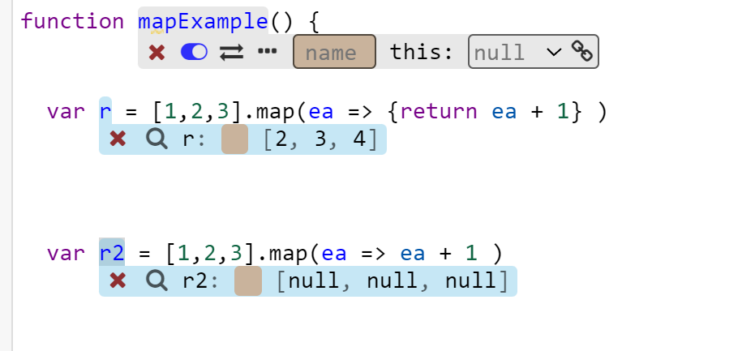

# Issues

 #TODO maybe we should use <https://github.com/LivelyKernel/lively4-core/issues>

## This probe should display a point

{width=300}

## 'undefined' is displayed as object

{width=300}

## Shorthand notation in arrow functions are broken

{width=300}

