<!-- markdown-config presentation=true -->

<link rel="stylesheet" type="text/css" href="../../../src/client/presentation.css"  />
<link rel="stylesheet" type="text/css" href="../../../src/client/lively.css"  />
<link rel="stylesheet" type="text/css" href="../../../templates/livelystyle.css"  />

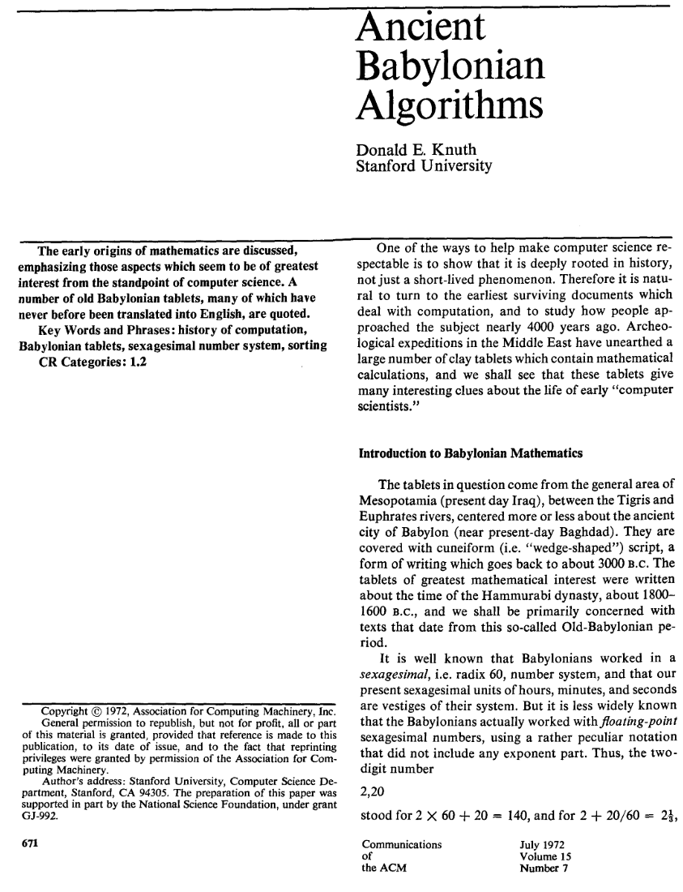{style="position:absolute; top:40px; left:40px; width:400px; border: 1px solid lightgray"}

---

{style="position:absolute; top:40px; left:40px; width:400px; border: 1px solid lightgray"}

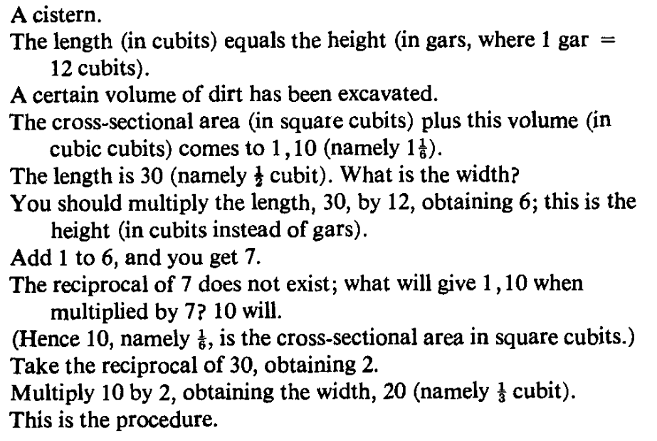{style="position:absolute; top:50px; left:450px; width:500px; border: 1px solid lightgray"}

---

{style="position:absolute; top:40px; left:40px; width:400px; border: 1px solid lightgray"}

{style="position:absolute; top:50px; left:450px; width:500px; border: 1px solid lightgray"}

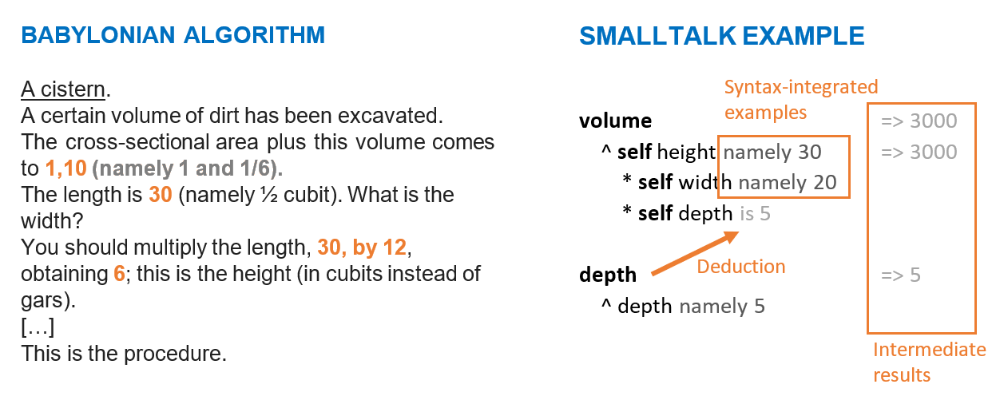{style="position:absolute; top:290px; left:130px; width:800px; border: 1px solid lightgray"}

---

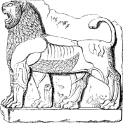{style="width: 200px; position: absolute; right: 20px;  bottom: 20px;"}

<a class="plain" href="https://arxiv.org/pdf/1902.00549">
Babylonian-style Programming 
</a>

Design and Implementation of a General-purpose Editor Supporting the Integration of Live Examples into Source Code

David Rauch, Patrick Rein, Stefan Ramson, Jens Lincke, and Robert Hirschfeld

   
  <a class="plain" href="https://www.hpi.uni-potsdam.de/hirschfeld/">Software Architecture Group 
Hasso Plattner Institute, University of Potsdam, Germany</a>
   
   
  <a class="plain" href="https://2019.programming-conference.org/"><b>‹Programming› 2019  Mon 1 - Thu 4 April 2019 Genoa, Italy</b></a>

---
## Existing Example-based Systems

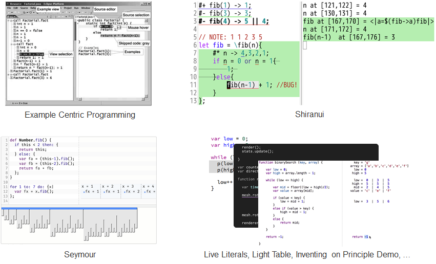{.centered}

---
# Design
## Probes  {.sub}

- Probe source code for values 
- Attach to syntax elements 
- See values for examples 
- See changes during statement 
- Chronological order 
- Object inspector supported

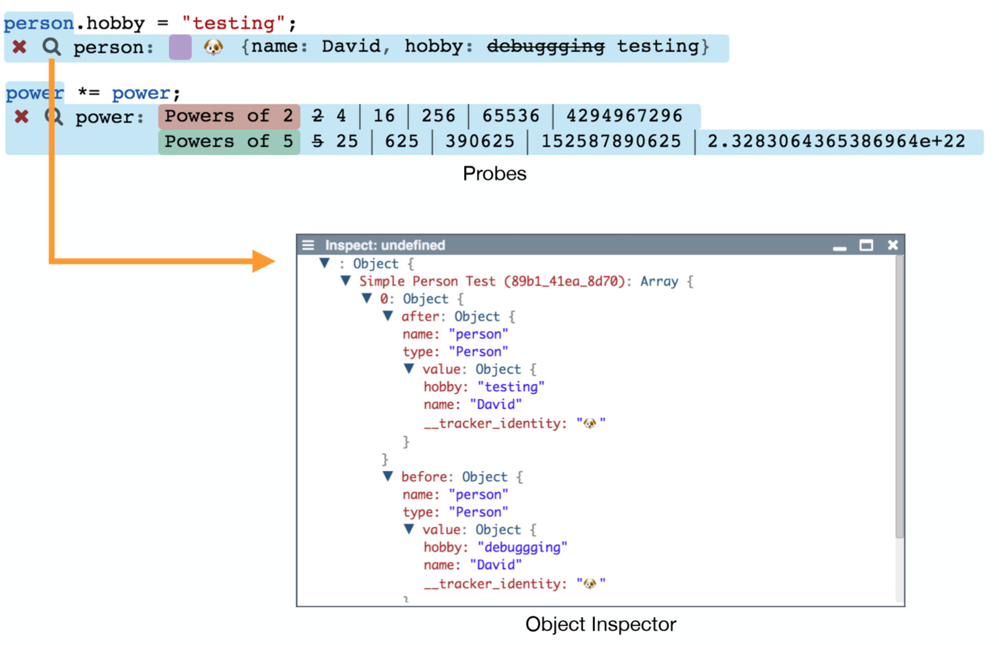{.right style="width:58%"}

--- 
# Design
## State over Time  {.sub}

- Sliders 
- Attach to flow control structures 
- Scroll through iterations 
- Probes filter values 
- Easier correlation of values

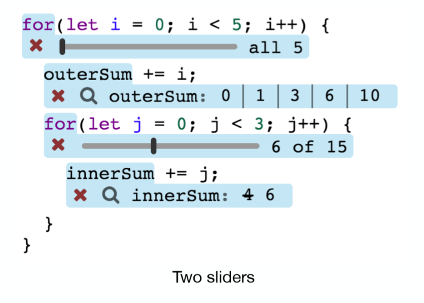{.right style="width:40%"}

--- 
# Design
## Objects and Data Structures  {.sub}

- Supported by probes 
- Usable in examples 
- (Custom) instance templates 
- Links

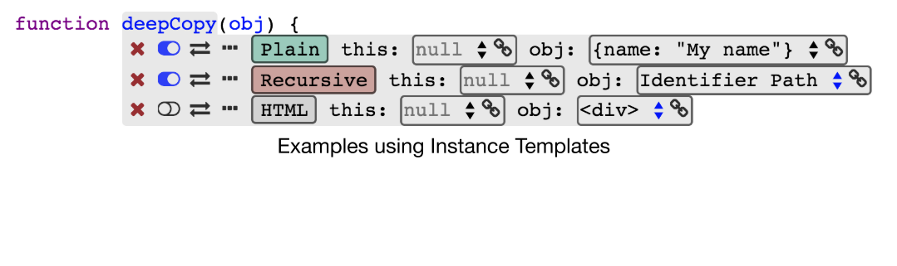{.bottomLeft}
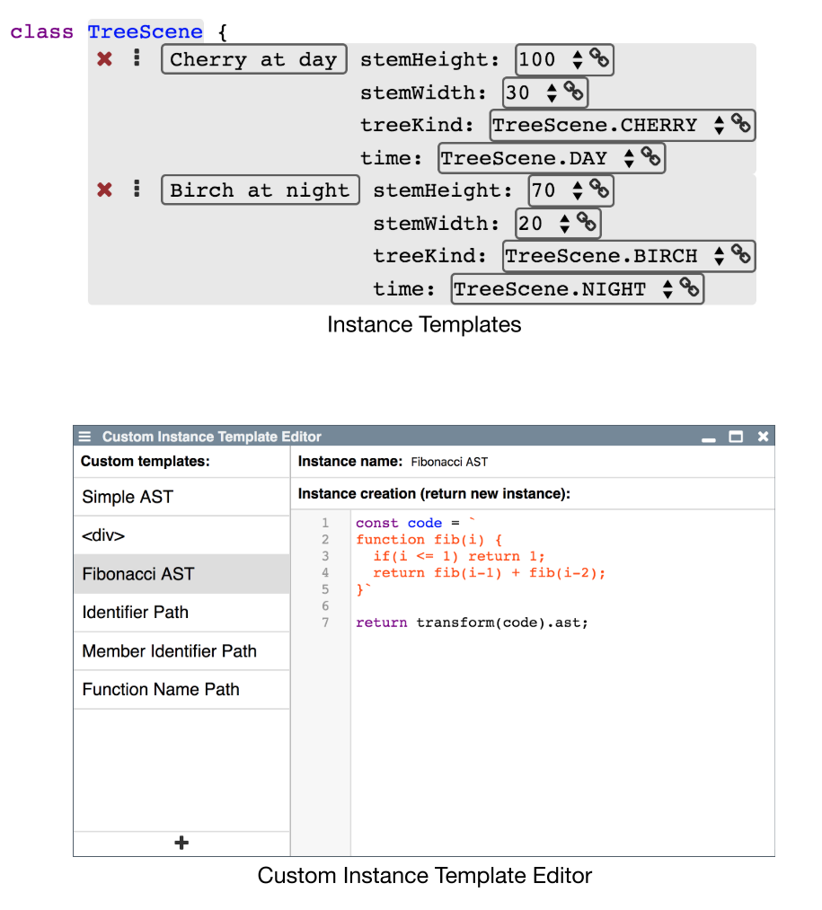{.right}

<!-- #TODO source: @rhi, Fibonacci -> similar.... -->

---
# Design
## Behavioral Highlighting  {.sub}

- Examples indicate intent 
- Fade out code that was not reached 
- Quickly find relevant code 
- Examine conditions without probes

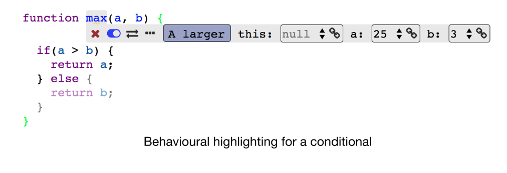{.right}

<!-- Behavioral highlighting for a conditional -->

---
# Design
## Persistent Examples  {.sub}

- Serialized to JSON 
- Saved as comments 
- Before and after syntax elements
- On load: parse and hide

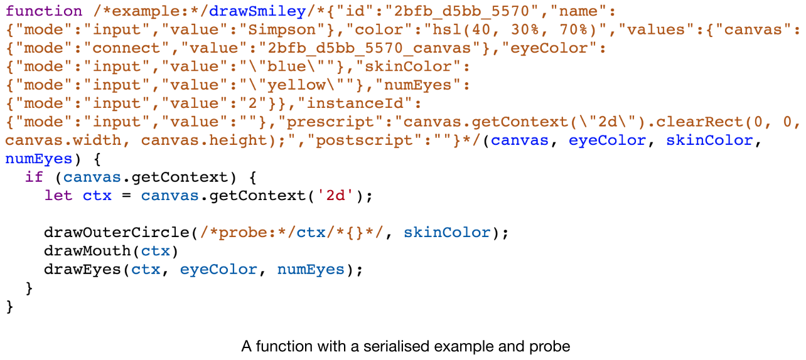{.right}

---
# Design
## Additional Features  {.sub}

- Replacements 
  - Replace source code 
  - Only for example evaluation
- Pre- and postscript 
  - Run before and after example 
  - Similar to setup and teardown

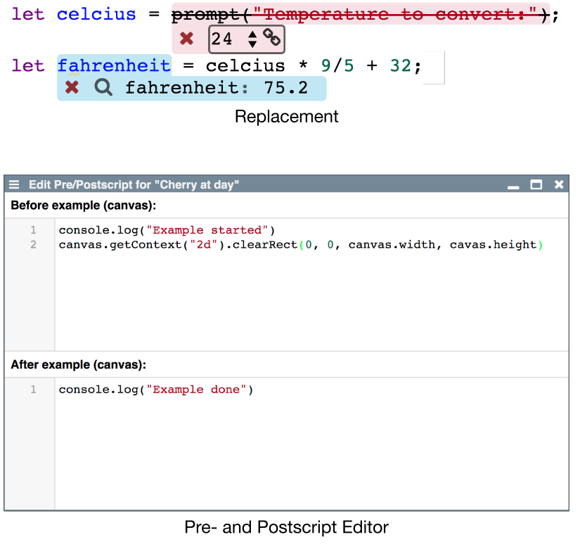{.right}

---
<!-- #TODO pull this up into presentation? -->
