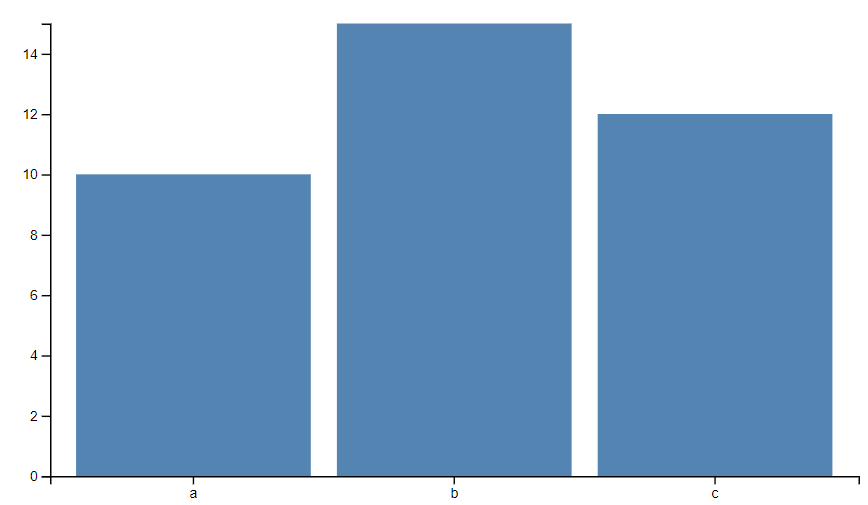
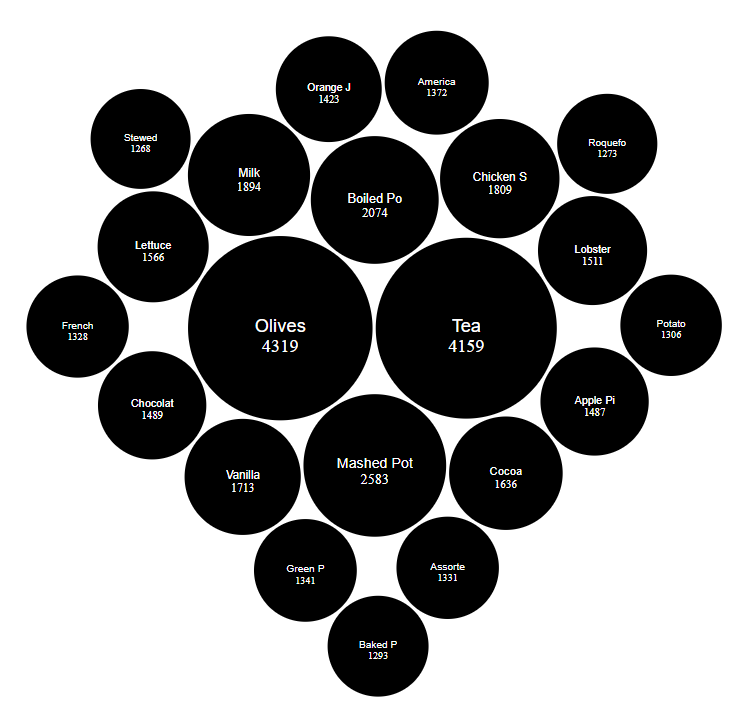
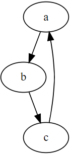
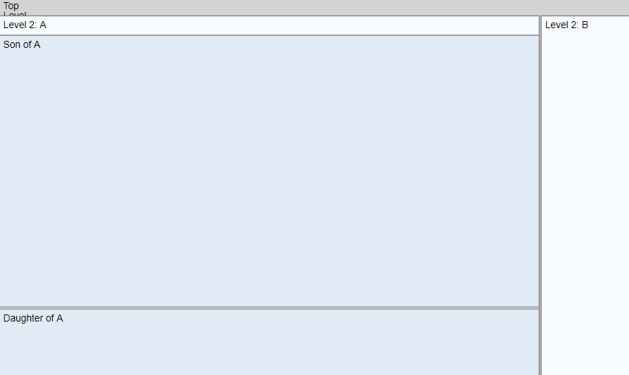
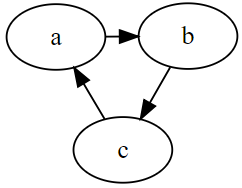

# D3 Components

  - [d3-barchart-gh.js](d3-barchart-gh.js) [html](d3-barchart-gh.html)   {width="200px"} {.box}
  - [d3-barchart.js](d3-barchart.js) [html](d3-barchart.html)    {width="200px"} {.box}
  - [d3-boxplot.js](d3-boxplot.js) [html](d3-boxplot.html)   {width="200px"} {.box}
  - [d3-bubblechart.js](d3-bubblechart.js) [html](d3-bubblechart.html)   {width="200px"} {.box}
  - [d3-bundleview.js](d3-bundleview.js) [html](d3-bundleview.html)   {width="200px"} {.box}
  - [d3-graphviz](open://d3-graphviz) [js](d3-graphviz.js) [html](d3-graphviz.html)   {width="60px"} {.box}
  - [d3-plaintree.js](d3-plaintree.js) [html](d3-plaintree.html)   {width="200px"} {.box}
  - [d3-polymetricview.js](d3-polymetricview.js) [html](d3-polymetricview.html)    {width="200px"} {.box}
  - [d3-radialtree.js](d3-radialtree.js) [html](d3-radialtree.html)   {width="200px"} {.box}
  - [d3-treemap.js](d3-treemap.js) [html](d3-treemap.html)  {width="200px"} {.box}
  - [graphviz-dot.js](graphviz-dot.js) [html](graphviz-dot.html)    {width="100px"} {.box}

## Helper
  - [d3-component.js](d3-component.js) [html](d3-component.html)
  - [d3-tree.js](d3-tree.js) [html](d3-tree.html)
  - [d3-box.js](d3-box.js)
<!-- 

-->