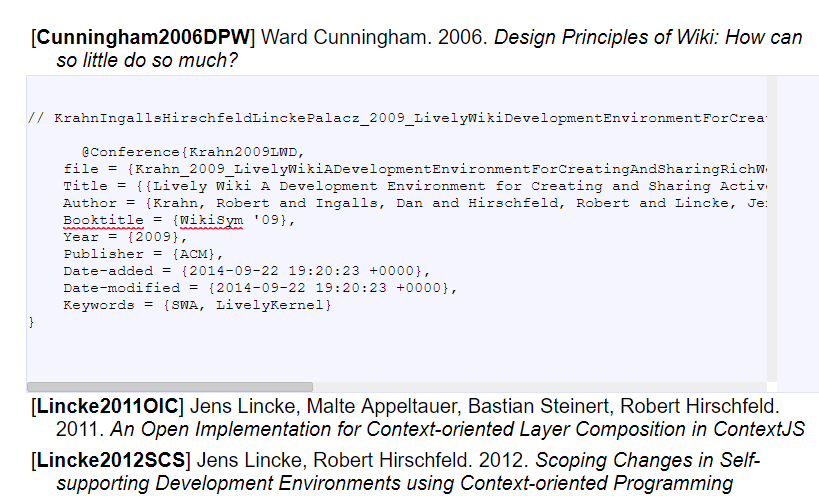
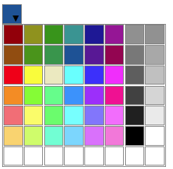

# Widgets Web Components

### lively-bibtex 
{width=300px}

A bidtex contains other lively-bibtex-entry

#### lively-bibtex-entry

### lively-code-mirror 
{width=300px}

#### lively-code-mirror-widget-import

### lively-component-bin-tile

### lively-connector
{width=300px}

## lively-dialog 

 [open](open://lively-drawboard) 

## lively-drawio [open](open://lively-drawio)
### lively-error  
### lively-essay
### lively-eval-element
### lively-file
### lively-iframe
### lively-import
### lively-key-value-input
### lively-key-value-map
### lively-link
### lively-list
### lively-markdown
### lively-menu
### lively-notification-list
### lively-notification
### lively-paper
### lively-pdf
### lively-penchooser
### lively-presentation
### lively-progress
### lively-resizer
### lively-script
### lively-separator
### lively-svg
 ### lively-table
### lively-window

